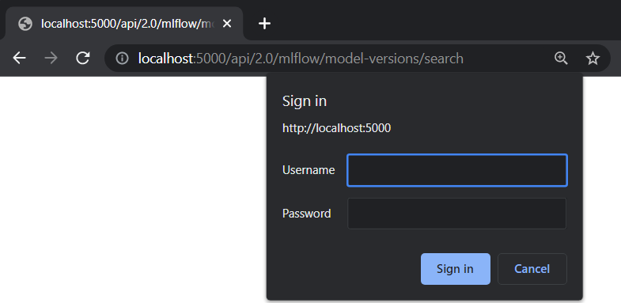

# MLflow Authentication {#auth}

Note

This feature is still experimental and may change in a future release
without warning.

MLflow supports basic HTTP authentication to enable access control over
experiments and registered models. Once enabled, any visitor will be
required to login before they can view any resource from the Tracking
Server.

Table of Contents

MLflow Authentication provides Python and REST API for managing users
and permissions.

-   

## Overview {#overview}

To enable MLflow authentication, launch the MLflow UI with the following
command:

~~~ bash
mlflow server --app-name basic-auth
~~~

Server admin can choose to disable this feature anytime by restarting
the server without the `app-name` flag. Any users and permissions
created will be persisted on a SQL database and will be back in service
once the feature is re-enabled.

Due to the nature of HTTP authentication, it is only supported on a
remote Tracking Server, where users send requests to the server via REST
APIs.

## How It Works {#how-it-works}

### Permissions {#permissions}

The available permissions are:

| Permission       | Can read | Can update | Can delete | Can manage |
|------------------|----------|------------|------------|------------|
| `READ`           | Yes      | No         | No         | No         |
| `EDIT`           | Yes      | Yes        | No         | No         |
| `MANAGE`         | Yes      | Yes        | Yes        | Yes        |
| `NO_PERMISSIONS` | No       | No         | No         | No         |

The default permission for all users is `READ`. It can be changed in the
`configuration <configuration>` file.

Permissions can be granted on individual resources for each user.
Supported resources include `Experiment` and `Registered Model`. To
access an API endpoint, an user must have the required permission.
Otherwise, a `403 Forbidden` response will be returned.

Required Permissions for accessing experiments:

| API                                                               | Endpoint                                    | Method | Required permission |
|------------------|------------------|------------------|------------------|
| `Create Experiment <mlflowMlflowServicecreateExperiment>`         | `2.0/mlflow/experiments/create`             | `POST` | None                |
| `Get Experiment <mlflowMlflowServicegetExperiment>`               | `2.0/mlflow/experiments/get`                | `GET`  | can_read            |
| `Get Experiment By Name <mlflowMlflowServicegetExperimentByName>` | `2.0/mlflow/experiments/get-by-name`        | `GET`  | can_read            |
| `Delete Experiment <mlflowMlflowServicedeleteExperiment>`         | `2.0/mlflow/experiments/delete`             | `POST` | can_delete          |
| `Restore Experiment <mlflowMlflowServicerestoreExperiment>`       | `2.0/mlflow/experiments/restore`            | `POST` | can_delete          |
| `Update Experiment <mlflowMlflowServiceupdateExperiment>`         | `2.0/mlflow/experiments/update`             | `POST` | can_update          |
| `Search Experiments <mlflowMlflowServicesearchExperiments>`       | `2.0/mlflow/experiments/search`             | `POST` | None                |
| `Search Experiments <mlflowMlflowServicesearchExperiments>`       | `2.0/mlflow/experiments/search`             | `GET`  | None                |
| `Set Experiment Tag <mlflowMlflowServicesetExperimentTag>`        | `2.0/mlflow/experiments/set-experiment-tag` | `POST` | can_update          |
| `Create Run <mlflowMlflowServicecreateRun>`                       | `2.0/mlflow/runs/create`                    | `POST` | can_update          |
| `Get Run <mlflowMlflowServicegetRun>`                             | `2.0/mlflow/runs/get`                       | `GET`  | can_read            |
| `Update Run <mlflowMlflowServiceupdateRun>`                       | `2.0/mlflow/runs/update`                    | `POST` | can_update          |
| `Delete Run <mlflowMlflowServicedeleteRun>`                       | `2.0/mlflow/runs/delete`                    | `POST` | can_delete          |
| `Restore Run <mlflowMlflowServicerestoreRun>`                     | `2.0/mlflow/runs/restore`                   | `POST` | can_delete          |
| `Search Runs <mlflowMlflowServicesearchRuns>`                     | `2.0/mlflow/runs/search`                    | `POST` | None                |
| `Set Tag <mlflowMlflowServicesetTag>`                             | `2.0/mlflow/runs/set-tag`                   | `POST` | can_update          |
| `Delete Tag <mlflowMlflowServicedeleteTag>`                       | `2.0/mlflow/runs/delete-tag`                | `POST` | can_update          |
| `Log Metric <mlflowMlflowServicelogMetric>`                       | `2.0/mlflow/runs/log-metric`                | `POST` | can_update          |
| `Log Param <mlflowMlflowServicelogParam>`                         | `2.0/mlflow/runs/log-parameter`             | `POST` | can_update          |
| `Log Batch <mlflowMlflowServicelogBatch>`                         | `2.0/mlflow/runs/log-batch`                 | `POST` | can_update          |
| `Log Model <mlflowMlflowServicelogModel>`                         | `2.0/mlflow/runs/log-model`                 | `POST` | can_update          |
| `List Artifacts <mlflowMlflowServicelistArtifacts>`               | `2.0/mlflow/artifacts/list`                 | `GET`  | can_read            |
| `Get Metric History <mlflowMlflowServicegetMetricHistory>`        | `2.0/mlflow/metrics/get-history`            | `GET`  | can_read            |

Required Permissions for accessing registered models:

| API                                                                                      | Endpoint                                           | Method   | Required permission |
|------------------|------------------|------------------|------------------|
| `Create Registered Model <mlflowModelRegistryServicecreateRegisteredModel>`              | `2.0/mlflow/registered-models/create`              | `POST`   | None                |
| `Rename Registered Model <mlflowModelRegistryServicerenameRegisteredModel>`              | `2.0/mlflow/registered-models/rename`              | `POST`   | can_update          |
| `Update Registered Model <mlflowModelRegistryServiceupdateRegisteredModel>`              | `2.0/mlflow/registered-models/update`              | `PATCH`  | can_update          |
| `Delete Registered Model <mlflowModelRegistryServicedeleteRegisteredModel>`              | `2.0/mlflow/registered-models/delete`              | `DELETE` | can_delete          |
| `Get Registered Model <mlflowModelRegistryServicegetRegisteredModel>`                    | `2.0/mlflow/registered-models/get`                 | `GET`    | can_read            |
| `Search Registered Models <mlflowModelRegistryServicesearchRegisteredModels>`            | `2.0/mlflow/registered-models/search`              | `GET`    | None                |
| `Get Latest Versions <mlflowModelRegistryServicegetLatestVersions>`                      | `2.0/mlflow/registered-models/get-latest-versions` | `POST`   | can_read            |
| `Get Latest Versions <mlflowModelRegistryServicegetLatestVersions>`                      | `2.0/mlflow/registered-models/get-latest-versions` | `GET`    | can_read            |
| `Set Registered Model Tag <mlflowModelRegistryServicesetRegisteredModelTag>`             | `2.0/mlflow/registered-models/set-tag`             | `POST`   | can_update          |
| `Delete Registered Model Tag <mlflowModelRegistryServicedeleteRegisteredModelTag>`       | `2.0/mlflow/registered-models/delete-tag`          | `DELETE` | can_update          |
| `Set Registered Model Alias <mlflowModelRegistryServicesetRegisteredModelAlias>`         | `2.0/mlflow/registered-models/alias`               | `POST`   | can_update          |
| `Delete Registered Model Alias <mlflowModelRegistryServicedeleteRegisteredModelAlias>`   | `2.0/mlflow/registered-models/alias`               | `DELETE` | can_delete          |
| `Get Model Version By Alias <mlflowModelRegistryServicegetModelVersionByAlias>`          | `2.0/mlflow/registered-models/alias`               | `GET`    | can_read            |
| `Create Model Version <mlflowModelRegistryServicecreateModelVersion>`                    | `2.0/mlflow/model-versions/create`                 | `POST`   | can_update          |
| `Update Model Version <mlflowModelRegistryServiceupdateModelVersion>`                    | `2.0/mlflow/model-versions/update`                 | `PATCH`  | can_update          |
| `Transition Model Version Stage <mlflowModelRegistryServicetransitionModelVersionStage>` | `2.0/mlflow/model-versions/transition-stage`       | `POST`   | can_update          |
| `Delete Model Version <mlflowModelRegistryServicedeleteModelVersion>`                    | `2.0/mlflow/model-versions/delete`                 | `DELETE` | can_delete          |
| `Get Model Version <mlflowModelRegistryServicegetModelVersion>`                          | `2.0/mlflow/model-versions/get`                    | `GET`    | can_read            |
| `Search Model Versions <mlflowModelRegistryServicesearchModelVersions>`                  | `2.0/mlflow/model-versions/search`                 | `GET`    | None                |
| `Get Model Version Download Uri <mlflowModelRegistryServicegetModelVersionDownloadUri>`  | `2.0/mlflow/model-versions/get-download-uri`       | `GET`    | can_read            |
| `Set Model Version Tag <mlflowModelRegistryServicesetModelVersionTag>`                   | `2.0/mlflow/model-versions/set-tag`                | `POST`   | can_update          |
| `Delete Model Version Tag <mlflowModelRegistryServicedeleteModelVersionTag>`             | `2.0/mlflow/model-versions/delete-tag`             | `DELETE` | can_delete          |

MLflow Authentication introduces several new API endpoints to manage
users and permissions.

| API                                                                                     | Endpoint                                          | Method   | Required permission         |
|------------------|------------------|------------------|------------------|
| `Create User <mlflowAuthServicecreateUser>`                                             | `2.0/mlflow/users/create`                         | `POST`   | None                        |
| `Get User <mlflowAuthServicegetUser>`                                                   | `2.0/mlflow/users/get`                            | `GET`    | Only readable by that user  |
| `Update User Password <mlflowAuthServiceupdateUserPassword>`                            | `2.0/mlflow/users/update-password`                | `PATCH`  | Only updatable by that user |
| `Update User Admin <mlflowAuthServiceupdateUserAdmin>`                                  | `2.0/mlflow/users/update-admin`                   | `PATCH`  | Only admin                  |
| `Delete User <mlflowAuthServicedeleteUser>`                                             | `2.0/mlflow/users/delete`                         | `DELETE` | Only admin                  |
| `Create Experiment Permission <mlflowAuthServicecreateExperimentPermission>`            | `2.0/mlflow/experiments/permissions/create`       | `POST`   | can_manage                  |
| `Get Experiment Permission <mlflowAuthServicegetExperimentPermission>`                  | `2.0/mlflow/experiments/permissions/get`          | `GET`    | can_manage                  |
| `Update Experiment Permission <mlflowAuthServiceupdateExperimentPermission>`            | `2.0/mlflow/experiments/permissions/update`       | `PATCH`  | can_manage                  |
| `Delete Experiment Permission <mlflowAuthServicedeleteExperimentPermission>`            | `2.0/mlflow/experiments/permissions/delete`       | `DELETE` | can_manage                  |
| `Create Registered Model Permission <mlflowAuthServicecreateRegisteredModelPermission>` | `2.0/mlflow/registered-models/permissions/create` | `POST`   | can_manage                  |
| `Get Registered Model Permission <mlflowAuthServicegetRegisteredModelPermission>`       | `2.0/mlflow/registered-models/permissions/get`    | `GET`    | can_manage                  |
| `Update Registered Model Permission <mlflowAuthServiceupdateRegisteredModelPermission>` | `2.0/mlflow/registered-models/permissions/update` | `PATCH`  | can_manage                  |
| `Delete Registered Model Permission <mlflowAuthServicedeleteRegisteredModelPermission>` | `2.0/mlflow/registered-models/permissions/delete` | `DELETE` | can_manage                  |

Some APIs will also have their behaviour modified. For example, the
creator of an experiment will automatically be granted `MANAGE`
permission on that experiment, so that the creator can grant or revoke
other users' access to that experiment.

| API                                                                           | Endpoint                              | Method | Effect                                                                  |
|------------------|------------------|------------------|------------------|
| `Create Experiment <mlflowMlflowServicecreateExperiment>`                     | `2.0/mlflow/experiments/create`       | `POST` | Automatically grants `MANAGE` permission to the creator.                |
| `Create Registered Model <mlflowModelRegistryServicecreateRegisteredModel>`   | `2.0/mlflow/registered-models/create` | `POST` | Automatically grants `MANAGE` permission to the creator.                |
| `Search Experiments <mlflowMlflowServicesearchExperiments>`                   | `2.0/mlflow/experiments/search`       | `POST` | Only returns experiments which the user has `READ` permission on.       |
| `Search Experiments <mlflowMlflowServicesearchExperiments>`                   | `2.0/mlflow/experiments/search`       | `GET`  | Only returns experiments which the user has `READ` permission on.       |
| `Search Runs <mlflowMlflowServicesearchRuns>`                                 | `2.0/mlflow/runs/search`              | `POST` | Only returns experiments which the user has `READ` permission on.       |
| `Search Registered Models <mlflowModelRegistryServicesearchRegisteredModels>` | `2.0/mlflow/registered-models/search` | `GET`  | Only returns registered models which the user has `READ` permission on. |
| `Search Model Versions <mlflowModelRegistryServicesearchModelVersions>`       | `2.0/mlflow/model-versions/search`    | `GET`  | Only returns registered models which the user has `READ` permission on. |

### Permissions Database {#permissions-database}

All users and permissions are stored in a database in `basic_auth.db`,
relative to the directory where MLflow server is launched. The location
can be changed in the `configuration <configuration>` file. To run
migrations, use the following command:

~~~ 
python -m mlflow.server.auth db upgrade --url <database_url>
~~~

### Admin Users {#admin-users}

Admin users have unrestricted access to all MLflow resources,
**including creating or deleting users, updating password and admin
status of other users, granting or revoking permissions from other
users, and managing permissions for all MLflow resources,** even if
`NO_PERMISSIONS` is explicitly set to that admin account.

MLflow has a built-in admin user that will be created the first time
that the MLflow authentication feature is enabled.

Note

It is recommended that you update the default admin password as soon as
possible after creation.

The default admin user credentials are as follows:

| Username | Password   |
|----------|------------|
| `admin`  | `password` |

Multiple admin users can exist by promoting other users to admin, using
the `2.0/mlflow/users/update-admin` endpoint.

~~~ bash
# authenticate as built-in admin user
export MLFLOW_TRACKING_USERNAME=admin
export MLFLOW_TRACKING_PASSWORD=password
~~~

~~~ python
from mlflow.server import get_app_client

tracking_uri = "http://localhost:5000/"

auth_client = get_app_client("basic-auth", tracking_uri=tracking_uri)
auth_client.create_user(username="user1", password="pw1")
auth_client.update_user_admin(username="user1", is_admin=True)
~~~

### Managing Permissions {#managing-permissions}

MLflow provides `REST APIs <mlflowAuthServiceCreateUser>` and a client
class `AuthServiceClient<mlflow.server.auth.client.AuthServiceClient>`
to manage users and permissions. To instantiate `AuthServiceClient`, it
is recommended that you use `mlflow.server.get_app_client`.

~~~ bash
export MLFLOW_TRACKING_USERNAME=admin
export MLFLOW_TRACKING_PASSWORD=password
~~~

~~~ python
from mlflow import MlflowClient
from mlflow.server import get_app_client

tracking_uri = "http://localhost:5000/"

auth_client = get_app_client("basic-auth", tracking_uri=tracking_uri)
auth_client.create_user(username="user1", password="pw1")
auth_client.create_user(username="user2", password="pw2")

client = MlflowClient(tracking_uri=tracking_uri)
experiment_id = client.create_experiment(name="experiment")

auth_client.create_experiment_permission(
    experiment_id=experiment_id, username="user2", permission="MANAGE"
)
~~~

## Authenticating to MLflow {#authenticating-to-mlflow}

### Using MLflow UI {#using-mlflow-ui}

When a user first visits the MLflow UI on a browser, they will be
prompted to login. There is no limit to how many login attempts can be
made.

Currently, MLflow UI does not display any information about the current
user. Once a user is logged in, the only way to log out is to close the
browser.

> 

### Using Environment Variables {#using-environment-variables}

MLflow provides two environment variables for authentication:
`MLFLOW_TRACKING_USERNAME` and `MLFLOW_TRACKING_PASSWORD`. To use basic
authentication, you must set both environment variables.

~~~ bash
export MLFLOW_TRACKING_USERNAME=username
export MLFLOW_TRACKING_PASSWORD=password
~~~

~~~ python
import mlflow

mlflow.set_tracking_uri("https://<mlflow_tracking_uri>/")
with mlflow.start_run():
    ...
~~~

### Using Credentials File {#using-credentials-file}

You can save your credentials in a file to remove the need for setting
environment variables every time. The credentials should be saved in
`~/.mlflow/credentials` using `INI` format. Note that the password will
be stored unencrypted on disk, and is protected only by filesystem
permissions.

If the environment variables `MLFLOW_TRACKING_USERNAME` and
`MLFLOW_TRACKING_PASSWORD` are configured, they override any credentials
provided in the credentials file.

~~~ ini
[mlflow]
mlflow_tracking_username = username
mlflow_tracking_password = password
~~~

### Using REST API {#using-rest-api}

A user can authenticate using the HTTP `Authorization` request header.
See <https://developer.mozilla.org/en-US/docs/Web/HTTP/Authentication>
for more information.

In Python, you can use the `requests` library:

~~~ python
import requests

response = requests.get(
    "https://<mlflow_tracking_uri>/",
    auth=("username", "password"),
)
~~~

## Creating a New User {#creating-a-new-user}

Important

To create a new user, you are required to authenticate with admin
privileges.

### Using MLflow UI {#using-mlflow-ui-1}

MLflow UI provides a simple page for creating new users at
`<tracking_uri>/signup`.

> 

### Using REST API {#using-rest-api-1}

Alternatively, you can send `POST` requests to the Tracking Server
endpoint `2.0/users/create`.

In Python, you can use the `requests` library:

~~~ python
import requests

response = requests.post(
    "https://<mlflow_tracking_uri>/api/2.0/mlflow/users/create",
    json={
        "username": "username",
        "password": "password",
    },
)
~~~

### Using MLflow AuthServiceClient {#using-mlflow-authserviceclient}

MLflow `AuthServiceClient<mlflow.server.auth.client.AuthServiceClient>`
provides a function to create new users easily.

~~~ python
import mlflow

auth_client = mlflow.server.get_app_client(
    "basic-auth", tracking_uri="https://<mlflow_tracking_uri>/"
)
auth_client.create_user(username="username", password="password")
~~~

## Configuration {#configuration}

Authentication configuration is located at
`mlflow/server/auth/basic_auth.ini`:

| Variable                 | Description                                                |
|------------------------------------|------------------------------------|
| `default_permission`     | Default permission on all resources                        |
| `database_uri`           | Database location to store permission and user data        |
| `admin_username`         | Default admin username if the admin is not already created |
| `admin_password`         | Default admin password if the admin is not already created |
| `authorization_function` | Function to authenticate requests                          |

The `authorization_function` setting supports pluggable authentication
methods if you want to use another authentication method than HTTP basic
auth. The value specifies `module_name:function_name`. The function has
the following signature:

> ~~~ python
> def authenticate_request() -> Union[Authorization, Response]:
>     ...
> ~~~

The function should return a `werkzeug.datastructures.Authorization`
object if the request is authenticated, or a `Response` object
(typically `401: Unauthorized`) if the request is not authenticated. For
an example of how to implement a custom authentication method, see
`tests/server/auth/jwt_auth.py`. **NOTE:** This example is not intended
for production use.

## Custom Authentication {#custom-authentication}

MLflow authentication is designed to be extensible. If your organization
desires more advanced authentication logic (e.g., token-based
authentication), it is possible to install a third party plugin or to
create your own plugin.

Your plugin should be an installable Python package. It should include
an app factory that extends the MLflow app and, optionally, implement a
client to manage permissions. The app factory function name will be
passed to the `--app` argument in Flask CLI. See
<https://flask.palletsprojects.com/en/latest/cli/#application-discovery>
for more information.

~~~ python
from flask import Flask
from mlflow.server import app

def create_app(app: Flask = app):
    app.add_url_rule(...)
    return app

class MyAuthClient:
    ...
~~~

Then, the plugin should be installed in your Python environment:

~~~ bash
pip install my_auth
~~~

Then, register your plugin in `mlflow/setup.py`:

~~~ python
setup(
    ...,
    entry_points="""
        ...

        [mlflow.app]
        my-auth=my_auth:create_app

        [mlflow.app.client]
        my-auth=my_auth:MyAuthClient
    """,
)
~~~

Then, you can start the MLflow server:

~~~ bash
mlflow server --app-name my-auth
~~~
