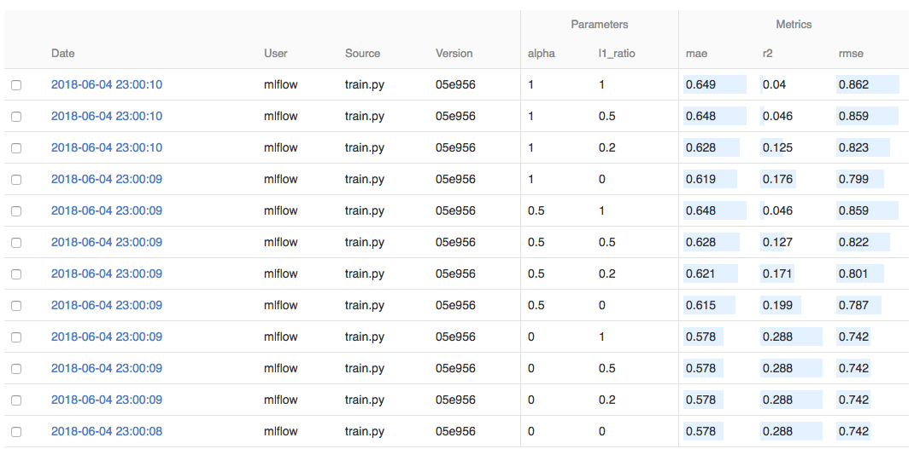
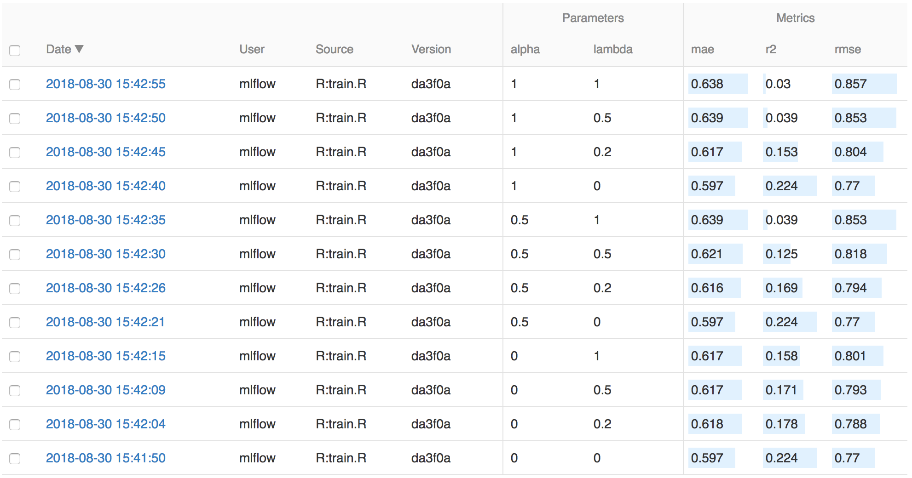
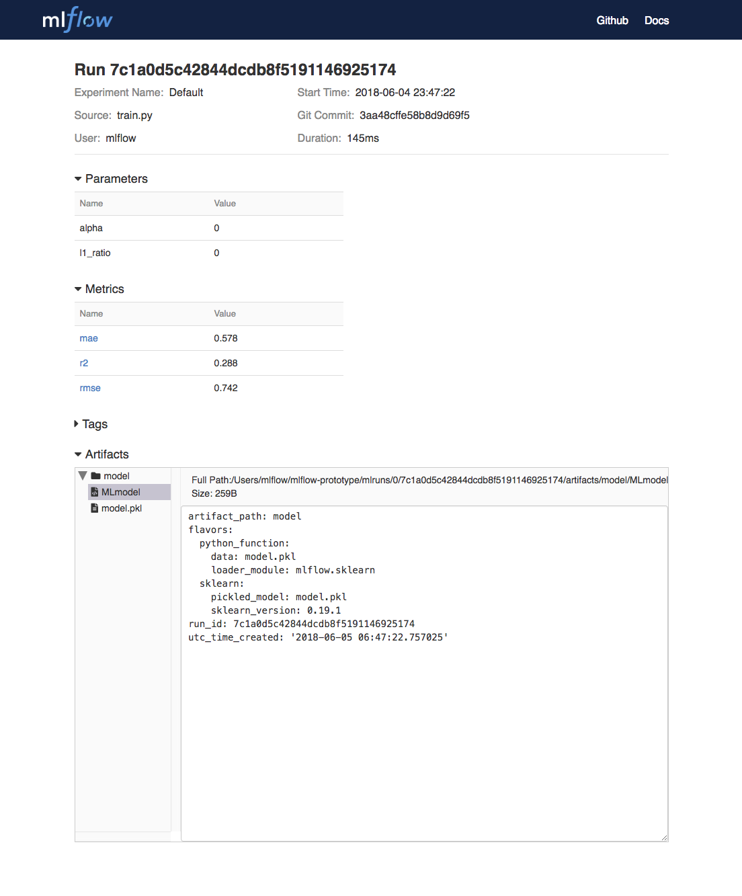
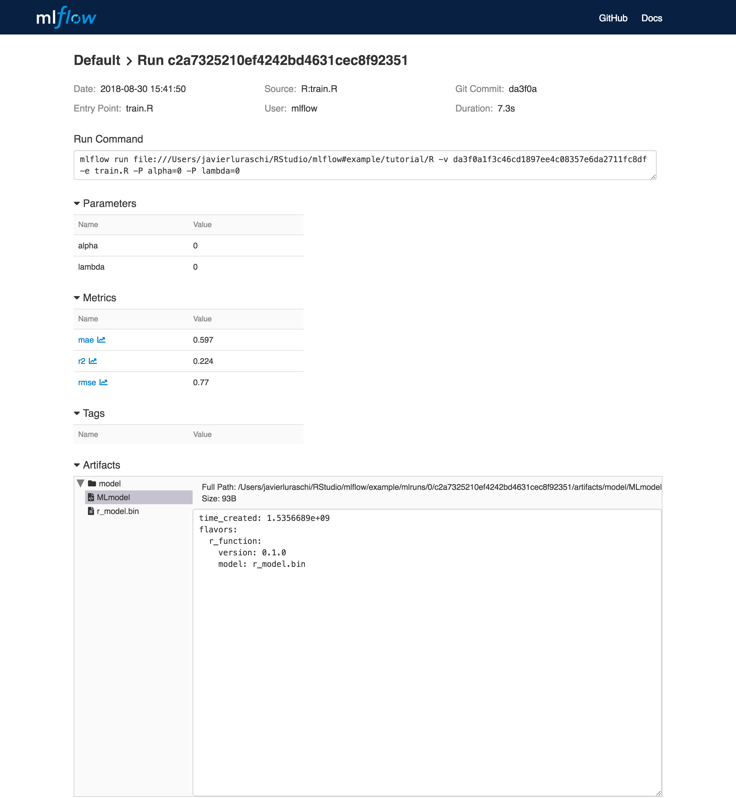
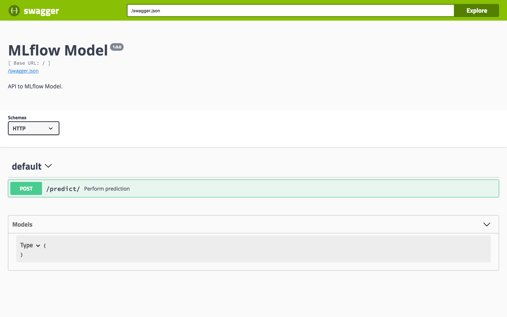

# Deploying a model to Kubernetes {#deploying-a-model-to-kubernetes}

This guide showcases how you can use MLflow end-to-end to:

-   Train a linear regression model
-   Package the code that trains the model in a reusable and
    reproducible model format
-   Deploy the model into a simple HTTP server that will enable you to
    score predictions

**Note** The modeling usecase shown here utilizes a common dataset to
predict the quality of wine based on quantitative features like the
wine's "fixed acidity", "pH", "residual sugar", and so on. The dataset
is from UCI's [machine learning
repository](http://archive.ics.uci.edu/ml/datasets/Wine+Quality). [^1]

Table of Contents

## What You'll Need {#what-youll-need}

In order to execute the code in this guide locally, you'll need to:

-   Install MLflow and scikit-learn. There are two options for
    installing these dependencies:

    > 1.  Install MLflow with extra dependencies, including scikit-learn
    >     (via `pip install mlflow[extras]`)
    > 2.  Install MLflow (via `pip install mlflow`) and install
    >     scikit-learn separately (via `pip install scikit-learn`)

-   Install
    [conda](https://conda.io/projects/conda/en/latest/user-guide/install/index.html)

-   Clone (download) the MLflow repository via
    `git clone https://github.com/mlflow/mlflow`

-   `cd` into the `examples` directory within your clone of MLflow -
    we'll use this working directory for walking through the guide. We
    avoid running directly from our clone of MLflow as doing so would
    use MLflow from the source (master branch), rather than your PyPI
    installation of MLflow.

-   Install the MLflow package (via `install.packages("mlflow")`)
-   Clone (download) the MLflow repository via
    `git clone https://github.com/mlflow/mlflow`
-   `setwd()` into the `examples` directory within your clone of
    MLflow - we'll use this working directory for running the code in
    this guide. We avoid running directly from our clone of MLflow as
    doing so would cause the code to execute using MLflow from source,
    rather than your PyPI installation of MLflow.

## Training the Model {#training-the-model}

First, train a linear regression model that takes two hyperparameters:
`alpha` and `l1_ratio`.

The code is located at `examples/sklearn_elasticnet_wine/train.py` and
is reproduced below.

../../../../examples/sklearn_elasticnet_wine/train.py

This example uses the familiar pandas, numpy, and sklearn APIs to create
a simple machine learning model. The
`MLflow tracking APIs<../../../tracking/>` log information about each
training run, like the hyperparameters `alpha` and `l1_ratio`, used to
train the model and metrics, like the root mean square error, used to
evaluate the model. The example also serializes the model in a format
that MLflow knows how to deploy.

You can run the example with default hyperparameters as follows:

~~~ shell
# Make sure the current working directory is 'examples'
python sklearn_elasticnet_wine/train.py
~~~

Try out some other values for `alpha` and `l1_ratio` by passing them as
arguments to `train.py`:

~~~ shell
# Make sure the current working directory is 'examples'
python sklearn_elasticnet_wine/train.py <alpha> <l1_ratio>
~~~

Each time you run the example, MLflow logs information about your
experiment runs in the directory `mlruns`.

Note

If you would like to use the Jupyter notebook version of `train.py`, try
out the example notebook at
`examples/sklearn_elasticnet_wine/train.ipynb`.

The code is located at `examples/r_wine/train.R` and is reproduced
below.

../../../../examples/r_wine/train.R

This example uses the familiar `glmnet` package to create a simple
machine learning model. The `MLflow tracking APIs<../../../tracking/>`
log information about each training run, like the hyperparameters
`alpha` and `lambda`, used to train the model and metrics, like the root
mean square error, used to evaluate the model. The example also
serializes the model in a format that MLflow knows how to deploy.

You can run the example with default hyperparameters as follows:

~~~ R
# Make sure the current working directory is 'examples'
mlflow_run(uri = "r_wine", entry_point = "train.R")
~~~

Try out some other values for `alpha` and `lambda` by passing them as
arguments to `train.R`:

~~~ R
# Make sure the current working directory is 'examples'
mlflow_run(uri = "r_wine", entry_point = "train.R", parameters = list(alpha = 0.1, lambda = 0.5))
~~~

Each time you run the example, MLflow logs information about your
experiment runs in the directory `mlruns`.

Note

If you would like to use an R notebook version of `train.R`, try the
example notebook at `examples/r_wine/train.Rmd`.

## Comparing the Models {#comparing-the-models}

Next, use the MLflow UI to compare the models that you have produced. In
the same current working directory as the one that contains the `mlruns`
run:

~~~ shell
mlflow ui
~~~

~~~ R
mlflow_ui()
~~~

and view it at <http://localhost:5000>.

On this page, you can see a list of experiment runs with metrics you can
use to compare the models.

You can use the search feature to quickly filter out many models. For
example, the query `metrics.rmse < 0.8` returns all the models with root
mean squared error less than 0.8. For more complex manipulations, you
can download this table as a CSV and use your favorite data munging
software to analyze it.

## Packaging Training Code in a Conda Environment {#conda-example}

Now that you have your training code, you can package it so that other
data scientists can easily reuse the model, or so that you can run the
training remotely, for example on Databricks.

You do this by using `../../projects` conventions to specify the
dependencies and entry points to your code. The
`sklearn_elasticnet_wine/MLproject` file specifies that the project has
the dependencies located in a [Conda environment
file](https://conda.io/projects/conda/en/latest/user-guide/tasks/manage-environments.html#creating-an-environment-file-manually)
called `conda.yaml` and has one entry point that takes two parameters:
`alpha` and `l1_ratio`.

../../../../examples/sklearn_elasticnet_wine/MLproject

`sklearn_elasticnet_wine/conda.yaml` file lists the dependencies:

../../../../examples/sklearn_elasticnet_wine/conda.yaml

To run this project, invoke
`mlflow run sklearn_elasticnet_wine -P alpha=0.42`. After running this
command, MLflow runs your training code in a new Conda environment with
the dependencies specified in `conda.yaml`.

If the repository has an `MLproject` file in the root you can also run a
project directly from GitHub. This guide is duplicated in the
<https://github.com/mlflow/mlflow-example> repository which you can run
with
`mlflow run https://github.com/mlflow/mlflow-example.git -P alpha=5.0`.

You do this by running `mlflow_snapshot()` to create an [R dependencies
packrat file](https://rstudio.github.io/packrat/) called
`r-dependencies.txt`.

The R dependencies file lists the dependencies:

~~~ r
# examples/r_wine/r-dependencies.txt

PackratFormat: 1.4
PackratVersion: 0.4.9.3
RVersion: 3.5.1
Repos: CRAN=https://cran.rstudio.com/

Package: BH
Source: CRAN
Version: 1.66.0-1
Hash: 4cc8883584b955ed01f38f68bc03af6d

Package: Matrix
Source: CRAN
Version: 1.2-14
Hash: 521aa8772a1941dfdb007bf532d19dde
Requires: lattice

...
~~~

To run this project, invoke:

~~~ r
# Make sure the current working directory is 'examples'
mlflow_run("r_wine", entry_point = "train.R", parameters = list(alpha = 0.2))
~~~

After running this command, MLflow runs your training code in a new R
session.

To restore the dependencies specified in `r-dependencies.txt`, you can
run instead:

~~~ r
mlflow_restore_snapshot()
# Make sure the current working directory is 'examples'
mlflow_run("r_wine", entry_point = "train.R", parameters = list(alpha = 0.2))
~~~

You can also run a project directly from GitHub. This guide is
duplicated in the <https://github.com/rstudio/mlflow-example> repository
which you can run with:

~~~ r
mlflow_run(
  "train.R",
  "https://github.com/rstudio/mlflow-example",
  parameters = list(alpha = 0.2)
)
~~~

## Specifying pip requirements using `pip_requirements` and `extra_pip_requirements` {#pip-requirements-example}

../../../../examples/pip_requirements/pip_requirements.py

## Serving the Model {#serving-the-model}

Now that you have packaged your model using the MLproject convention and
have identified the best model, it is time to deploy the model using
`../../../models`. An MLflow Model is a standard format for packaging
machine learning models that can be used in a variety of downstream
tools — for example, real-time serving through a REST API or batch
inference on Apache Spark.

In the example training code, after training the linear regression
model, a function in MLflow saved the model as an artifact within the
run.

~~~ python
mlflow.sklearn.log_model(lr, "model")
~~~

To view this artifact, you can use the UI again. When you click a date
in the list of experiment runs you'll see this page.

At the bottom, you can see that the call to `mlflow.sklearn.log_model`
produced two files in
`/Users/mlflow/mlflow-prototype/mlruns/0/7c1a0d5c42844dcdb8f5191146925174/artifacts/model`.
The first file, `MLmodel`, is a metadata file that tells MLflow how to
load the model. The second file, `model.pkl`, is a serialized version of
the linear regression model that you trained.

In this example, you can use this MLmodel format with MLflow to deploy a
local REST server that can serve predictions.

To deploy the server, run (replace the path with your model's actual
path):

~~~ bash
mlflow models serve -m /Users/mlflow/mlflow-prototype/mlruns/0/7c1a0d5c42844dcdb8f5191146925174/artifacts/model -p 1234
~~~

Note

The version of Python used to create the model must be the same as the
one running `mlflow models serve`. If this is not the case, you may see
the error
`UnicodeDecodeError: 'ascii' codec can't decode byte 0x9f in position 1: ordinal not in range(128)`
or `raise ValueError, "unsupported pickle protocol: %d"`.

Once you have deployed the server, you can pass it some sample data and
see the predictions. The following example uses `curl` to send a
JSON-serialized pandas DataFrame with the `split` orientation to the
model server. For more information about the input data formats accepted
by the model server, see the
`MLflow deployment tools documentation <local_model_deployment>`.

~~~ bash
# On Linux and macOS
curl -X POST -H "Content-Type:application/json" --data '{"dataframe_split": {"columns":["fixed acidity", "volatile acidity", "citric acid", "residual sugar", "chlorides", "free sulfur dioxide", "total sulfur dioxide", "density", "pH", "sulphates", "alcohol"],"data":[[6.2, 0.66, 0.48, 1.2, 0.029, 29, 75, 0.98, 3.33, 0.39, 12.8]]}}' http://127.0.0.1:1234/invocations

# On Windows
curl -X POST -H "Content-Type:application/json" --data "{\"dataframe_split\": {\"columns\":[\"fixed acidity\", \"volatile acidity\", \"citric acid\", \"residual sugar\", \"chlorides\", \"free sulfur dioxide\", \"total sulfur dioxide\", \"density\", \"pH\", \"sulphates\", \"alcohol\"],\"data\":[[6.2, 0.66, 0.48, 1.2, 0.029, 29, 75, 0.98, 3.33, 0.39, 12.8]]}}" http://127.0.0.1:1234/invocations
~~~

the server should respond with output similar to:

    [6.379428821398614]

~~~ r
mlflow_log_model(predictor, "model")
~~~

To view this artifact, you can use the UI again. When you click a date
in the list of experiment runs you'll see this page.

At the bottom, you can see that the call to `mlflow_log_model()`
produced two files in
`mlruns/0/c2a7325210ef4242bd4631cec8f92351/artifacts/model/`. The first
file, `MLmodel`, is a metadata file that tells MLflow how to load the
model. The second file, `r_model.bin`, is a serialized version of the
linear regression model that you trained.

In this example, you can use this MLmodel format with MLflow to deploy a
local REST server that can serve predictions.

To deploy the server, run:

~~~ r
mlflow_rfunc_serve(model_uri="mlruns/0/c2a7325210ef4242bd4631cec8f92351/artifacts/model", port=8090)
~~~

This initializes a REST server and opens a
[Swagger](https://swagger.io/) interface to perform predictions against
the REST API:

Note

By default, a model is served using the R packages available. To ensure
the environment serving the prediction function matches the model, set
`restore = TRUE` when calling `mlflow_rfunc_serve()`.

To serve a prediction, enter this in the Swagger UI:

    {
      "fixed acidity": 6.2,
      "volatile acidity": 0.66,
      "citric acid": 0.48,
      "residual sugar": 1.2,
      "chlorides": 0.029,
      "free sulfur dioxide": 29,
      "total sulfur dioxide": 75,
      "density": 0.98,
      "pH": 3.33,
      "sulphates": 0.39,
      "alcohol": 12.8
    }

which should return something like:

    [
      [
        6.4287492410792
      ]
    ]

Or run:

~~~ bash
# On Linux and macOS
curl -X POST "http://127.0.0.1:8090/predict/" -H "accept: application/json" -H "Content-Type: application/json" -d "{"fixed acidity": 6.2, "volatile acidity": 0.66, "citric acid": 0.48, "residual sugar": 1.2, "chlorides": 0.029, "free sulfur dioxide": 29, "total sulfur dioxide": 75, "density": 0.98, "pH": 3.33, "sulphates": 0.39, "alcohol": 12.8}"

# On Windows
curl -X POST "http://127.0.0.1:8090/predict/" -H "accept: application/json" -H "Content-Type: application/json" -d "{\"fixed acidity\": 6.2, \"volatile acidity\": 0.66, \"citric acid\": 0.48, \"residual sugar\": 1.2, \"chlorides\": 0.029, \"free sulfur dioxide\": 29, \"total sulfur dioxide\": 75, \"density\": 0.98, \"pH\": 3.33, \"sulphates\": 0.39, \"alcohol\": 12.8}"
~~~

the server should respond with output similar to:

    [[6.4287492410792]]

## Deploy the Model to Seldon Core or KServe {#deploy-the-model-to-seldon-core-or-kserve}

After training and testing our model, we are now ready to deploy it to
production. MLflow allows you to `serve your model using
MLServer<serving_with_mlserver>`, which is already used as the core
Python inference server in Kubernetes-native frameworks including
[Seldon Core](https://docs.seldon.io/projects/seldon-core/en/latest/)
and [KServe (formerly known as
KFServing)](https://kserve.github.io/website/). Therefore, we can
leverage this support to build a Docker image compatible with these
frameworks.

Note

This an **optional step**, which is currently only available for Python
models. This step also requires some basic Kubernetes knowledge,
including familiarity with `kubectl`.

To build a Docker image containing our model, we can use the
`mlflow models build-docker` subcommand, alongside the
`--enable-mlserver` flag. For example, to build a image named
`my-docker-image`, we could do:

~~~ bash
mlflow models build-docker \
  -m /Users/mlflow/mlflow-prototype/mlruns/0/7c1a0d5c42844dcdb8f5191146925174/artifacts/model \
  -n my-docker-image \
  --enable-mlserver
~~~

Once we have our image built, the next step will be to deploy it to our
cluster. One way to do this is by applying the respective Kubernetes
manifests through the `kubectl` CLI:

~~~ bash
kubectl apply -f my-manifest.yaml
~~~

This step assumes that you've got `kubectl` access to a Kubernetes
cluster already setup with Seldon Core. To read more on how to set this
up, you can refer to the [Seldon Core quickstart
guide](https://docs.seldon.io/projects/seldon-core/en/latest/workflow/github-readme.html).

~~~ yaml
apiVersion: machinelearning.seldon.io/v1
kind: SeldonDeployment
metadata:
  name: mlflow-model
spec:
  protocol: v2
  predictors:
    - name: default
      graph:
        name: mlflow-model
        type: MODEL
      componentSpecs:
        - spec:
            containers:
              - name: mlflow-model
                image: my-docker-image
~~~

This step assumes that you've got `kubectl` access to a Kubernetes
cluster already setup with KServe. To read more on how to set this up,
you can refer to the [KServe quickstart
guide](https://kserve.github.io/website/get_started/).

~~~ yaml
apiVersion: serving.kserve.io/v1beta1
kind: InferenceService
metadata:
  name: mlflow-model
spec:
  predictor:
    containers:
      - name: mlflow-model
        image: my-docker-image
        ports:
          - containerPort: 8080
            protocol: TCP
        env:
          - name: PROTOCOL
            value: v2
~~~

Congratulations on finishing the guide!

[^1]:
    1.  Cortez, A. Cerdeira, F. Almeida, T. Matos and J. Reis. Modeling
        wine preferences by data mining from physicochemical properties.
        In Decision Support Systems, Elsevier, 47(4):547-553, 2009.
