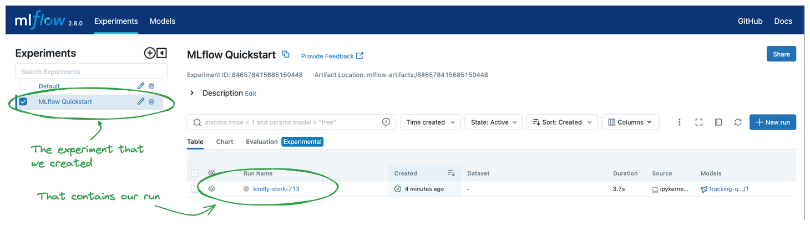
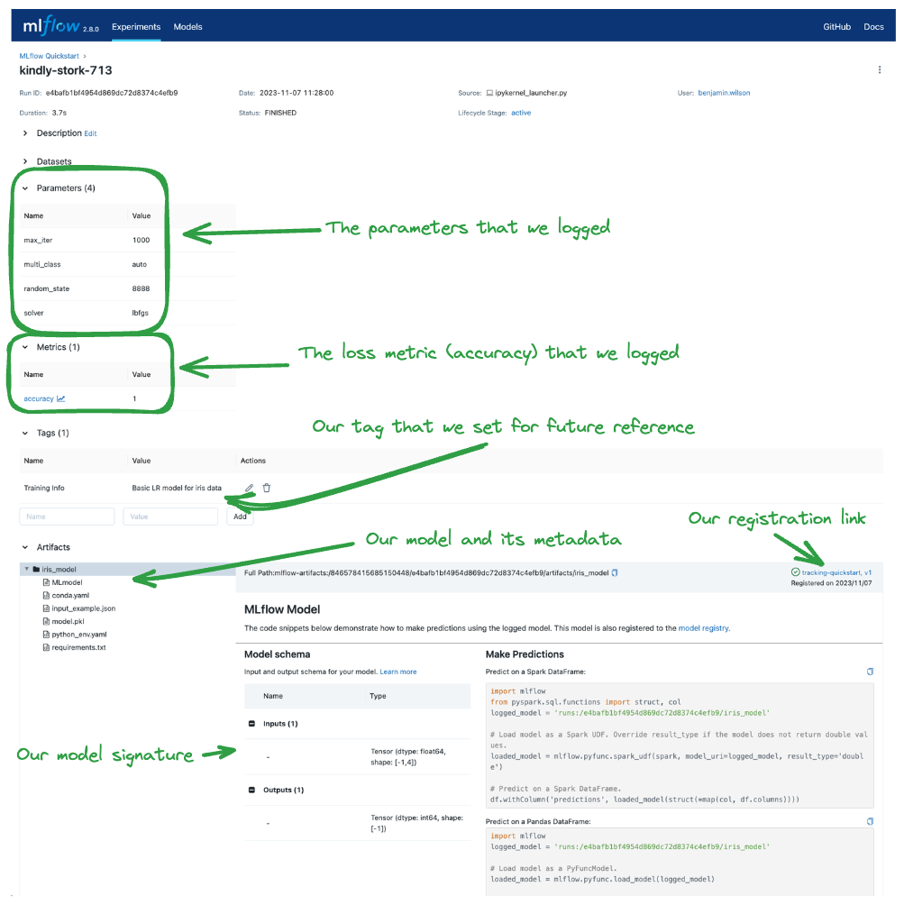

# MLflow Tracking Quickstart {#mlflow-tracking-quickstart}

Welcome to MLflow!

The purpose of this quickstart is to provide a quick guide to the most
essential core APIs of MLflow Tracking. Specifically, those that enable
the logging, registering, and loading of a model for inference.

Note

For a more in-depth and tutorial-based approach (if that is your style),
please see the [Getting Started with
MLflow](../logging-first-model/index.html) tutorial. We recommend that
you start here first, though, as this quickstart uses the most common
and frequently-used APIs for MLflow Tracking and serves as a good
foundation for the other tutorials in the documentation.

## What you will learn {#what-you-will-learn}

In just a few minutes of following along with this quickstart, you will
learn:

-   How to **log** parameters, metrics, and a model
-   The basics of the **MLflow fluent API**
-   How to **register** a model during logging
-   How to navigate to a model in the **MLflow UI**
-   How to **load** a logged model for inference

If you would like to see this quickstart in a purely notebook format, we
have a downloadable and viewable notebook-only version of this
quickstart:

<a href="notebooks/index.html" class="download-btn">View the Notebook</a>

notebooks/index

## Step 1 - Get MLflow {#step-1---get-mlflow}

MLflow is available on PyPI. If you don't already have it installed on
your system, you can install it with:

~~~ bash
pip install mlflow
~~~

## Step 2 - Start a Tracking Server {#step-2---start-a-tracking-server}

We're going to start a local MLflow Tracking Server, which we will
connect to for logging our data for this quickstart. From a terminal,
run:

~~~ bash
mlflow server --host 127.0.0.1 --port 8080
~~~

Note

You can choose any port that you would like, provided that it's not
already in use.

## Step 3 - Train a model and prepare metadata for logging {#step-3---train-a-model-and-prepare-metadata-for-logging}

In this section, we're going to log a model with MLflow. A quick
overview of the steps are:

-   Load and prepare the Iris dataset for modeling.
-   Train a Logistic Regression model and evaluate its performance.
-   Prepare the model hyperparameters and calculate metrics for logging.

~~~ python
import mlflow
from mlflow.models import infer_signature

import pandas as pd
from sklearn import datasets
from sklearn.model_selection import train_test_split
from sklearn.linear_model import LogisticRegression
from sklearn.metrics import accuracy_score, precision_score, recall_score, f1_score

# Load the Iris dataset
X, y = datasets.load_iris(return_X_y=True)

# Split the data into training and test sets
X_train, X_test, y_train, y_test = train_test_split(
    X, y, test_size=0.2, random_state=42
)

# Define the model hyperparameters
params = {
    "solver": "lbfgs",
    "max_iter": 1000,
    "multi_class": "auto",
    "random_state": 8888,
}

# Train the model
lr = LogisticRegression(**params)
lr.fit(X_train, y_train)

# Predict on the test set
y_pred = lr.predict(X_test)

# Calculate metrics
accuracy = accuracy_score(y_test, y_pred)
~~~

## Step 4 - Log the model and its metadata to MLflow {#step-4---log-the-model-and-its-metadata-to-mlflow}

In this next step, we're going to use the model that we trained, the
hyperparameters that we specified for the model's fit, and the loss
metrics that were calculated by evaluating the model's performance on
the test data to log to MLflow.

The steps that we will take are:

-   Initiate an MLflow **run** context to start a new run that we will
    log the model and metadata to.
-   **Log** model **parameters** and performance **metrics**.
-   **Tag** the run for easy retrieval.
-   **Register** the model in the MLflow Model Registry while
    **logging** (saving) the model.

Note

While it can be valid to wrap the entire code within the `start_run`
block, this is **not recommended**. If there as in issue with the
training of the model or any other portion of code that is unrelated to
MLflow-related actions, an empty or partially-logged run will be
created, which will necessitate manual cleanup of the invalid run. It is
best to keep the training execution outside of the run context block to
ensure that the loggable content (parameters, metrics, artifacts, and
the model) are fully materialized prior to logging.

~~~ python
# Set our tracking server uri for logging
mlflow.set_tracking_uri(uri="http://127.0.0.1:8080")

# Create a new MLflow Experiment
mlflow.set_experiment("MLflow Quickstart")

# Start an MLflow run
with mlflow.start_run():
    # Log the hyperparameters
    mlflow.log_params(params)

    # Log the loss metric
    mlflow.log_metric("accuracy", accuracy)

    # Set a tag that we can use to remind ourselves what this run was for
    mlflow.set_tag("Training Info", "Basic LR model for iris data")

    # Infer the model signature
    signature = infer_signature(X_train, lr.predict(X_train))

    # Log the model
    model_info = mlflow.sklearn.log_model(
        sk_model=lr,
        artifact_path="iris_model",
        signature=signature,
        input_example=X_train,
        registered_model_name="tracking-quickstart",
    )
~~~

## Step 5 - Load the model as a Python Function (pyfunc) and use it for inference {#step-5---load-the-model-as-a-python-function-pyfunc-and-use-it-for-inference}

After logging the model, we can perform inference by:

-   **Loading** the model using MLflow's
    pyfunc flavor.
-   Running **Predict** on new data using the loaded model.

Note

The iris training data that we used was a numpy array structure.
However, we can submit a Pandas DataFrame as well to the
predict method, as shown below.

~~~ python
# Load the model back for predictions as a generic Python Function model
loaded_model = mlflow.pyfunc.load_model(model_info.model_uri)

predictions = loaded_model.predict(X_test)

iris_feature_names = datasets.load_iris().feature_names

result = pd.DataFrame(X_test, columns=iris_feature_names)
result["actual_class"] = y_test
result["predicted_class"] = predictions

result[:4]
~~~

The output of this code will look something like this:

| sepal length (cm) | sepal width (cm) | petal length (cm) | petal width (cm) | actual_class | predicted_class |
|-------------|------------|-------------|------------|----------|------------|
| 6.1               | 2.8              | 4.7               | 1.2              | 1            | 1               |
| 5.7               | 3.8              | 1.7               | 0.3              | 0            | 0               |
| 7.7               | 2.6              | 6.9               | 2.3              | 2            | 2               |
| 6.0               | 2.9              | 4.5               | 1.5              | 1            | 1               |

## Step 6 - View the Run in the MLflow UI {#step-6---view-the-run-in-the-mlflow-ui}

In order to see the results of our run, we can navigate to the MLflow
UI. Since we have already started the Tracking Server at
http://localhost:8080, we can simply
navigate to that URL in our browser.

When opening the site, you will see a screen similar to the following:

<figure>

<figcaption>The main MLflow Tracking page, showing Experiments that have
been created</figcaption>
</figure>

Clicking on the name of the Experiment that we created ("MLflow
Quickstart") will give us a list of runs associated with the Experiment.
You should see a random name that has been generated for the run and
nothing else show up in the Table list
view to the right.

Clicking on the name of the run will take you to the Run page, where the
details of what we've logged will be shown. The elements have been
highlighted below to show how and where this data is recorded within the
UI.

<figure>

<figcaption>The run view page for our run</figcaption>
</figure>

## Conclusion {#conclusion}

Congratulations on working through the MLflow Tracking Quickstart! You
should now have a basic understanding of how to use the MLflow Tracking
API to log models.

If you are interested in a more in-depth tutorial, please see the
[Getting Started with MLflow](../logging-first-model/index.html)
tutorial as a good next step in increasing your knowledge about MLflow!
