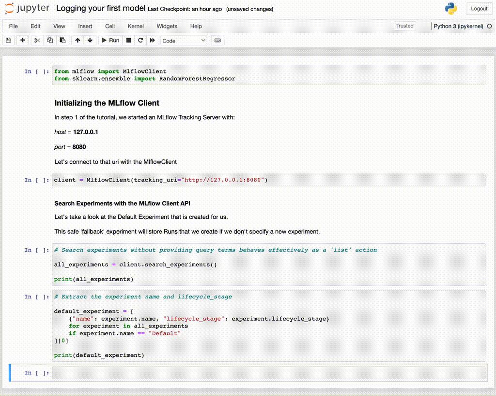

# Using the MLflow Client API {#using-the-mlflow-client-api}

In the previous section, we started an instance of the MLflow Tracking
Server and the MLflow UI. For this stage, we're going to be interfacing
with the Tracking Server through one of the primary mechanisms that you
will use when training ML models, the
`MlflowClient <mlflow.client.MlflowClient>`. For the duration of this
tutorial, this client API will be your primary interface for MLflow's
tracking capabilities, enabling you to:

-   Initiate a new Experiment.
-   Start Runs within an Experiment.
-   Document parameters, metrics, and tags for your Runs.
-   Log artifacts linked to runs, such as models, tables, plots, and
    more.

## Importing Dependencies {#importing-dependencies}

In order to use the MLflowClient API, the initial step involves
importing the necessary modules.

~~~ python
from mlflow import MlflowClient
from pprint import pprint
from sklearn.ensemble import RandomForestRegressor
~~~

With these modules imported, you're now prepared to configure the client
and relay specifics about the location of your tracking server.

## Configuring the MLflow Tracking Client {#configuring-the-mlflow-tracking-client}

By default, barring any modifications to the `MLFLOW_TRACKING_URI`
environment variable, initializing the MlflowClient will designate your
local storage as the tracking server. This means your experiments, data,
models, and related attributes will be stored within the active
execution directory.

For the context of this guide, we'll utilize the tracking server
initialized earlier in the documentation, instead of using the client to
log to the local file system directory.

In order to connect to the tracking server that we created in the
previous section of this tutorial, we'll need to use the uri that we
assigned the server when we started it. The two components that we
submitted as arguments to the `mlflow server` command were the `host`
and the `port`. Combined, these form the `tracking_uri` argument that we
will specify to start an instance of the client.

~~~ python
client = MlflowClient(tracking_uri="http://127.0.0.1:8080")
~~~

We now have a client interface to the tracking server that can both send
data to and retrieve data from the tracking server.

## The Default Experiment {#the-default-experiment}

Before we get to logging anything to the Tracking Server, let's take a
look at a key feature that exists at the outset of starting any MLflow
Tracking Server: the Default Experiment.

The Default Experiment is a placeholder that is used to encapsulate all
run information if an explicit Experiment is not declared. While using
MLflow, you'll be creating new experiments in order to organize
projects, project iterations, or logically group large modeling
activities together in a grouped hierarchical collection. However, if
you manage to forget to create a new Experiment before using the MLflow
tracking capabilities, the Default Experiment is a fallback for you to
ensure that your valuable tracking data is not lost when executing a
run.

Let's see what this Default Experiment looks like by using the
`mlflow.client.MlflowClient.search_experiments` API.

## Searching Experiments {#searching-experiments}

The first thing that we're going to do is to view the metadata
associated with the Experiments that are on the server. We can
accomplish this through the use of the
`mlflow.client.MlflowClient.search_experiments` API. Let's issue a
search query to see what the results are.

~~~ python
all_experiments = client.search_experiments()

print(all_experiments)
~~~

~~~ bash
[<Experiment: artifact_location='./mlruns/0', creation_time=None, experiment_id='0', last_update_time=None, lifecycle_stage='active', name='Default', tags={}>]
~~~

It is worth noting that the return type of the `search_experiments()`
API is not a basic collection structure. Rather, it is a list of
`Experiment` objects. Many of the return values of MLflow's client APIs
return objects that contain metadata attributes associated with the task
being performed. This is an important aspect to remember, as it makes
more complex sequences of actions easier to perform, which will be
covered in later tutorials.

With the returned collection, we can iterate over these objects with a
comprehension to access the specific metadata attributes of the
Default experiment.

To get familiar with accessing elements from returned collections from
MLflow APIs, let's extract the `name` and the `lifecycle_stage` from the
`search_experiments()` query and extract these attributes into a dict.

~~~ python
default_experiment = [
    {"name": experiment.name, "lifecycle_stage": experiment.lifecycle_stage}
    for experiment in all_experiments
    if experiment.name == "Default"
][0]

pprint(default_experiment)
~~~

~~~ bash
{'name': 'Default', 'lifecycle_stage': 'active'}
~~~

## Running it {#running-it}

<figure>

<figcaption>Using the MLflow Client's search_experiments() API to view
the Default Experiment</figcaption>
</figure>

In the next step, we'll create our first experiment and dive into the
options that are available for providing metadata information that helps
to keep track of related experiments and organize our runs within
experiments so that we can effectively compare the results of different
parameters for training runs.
