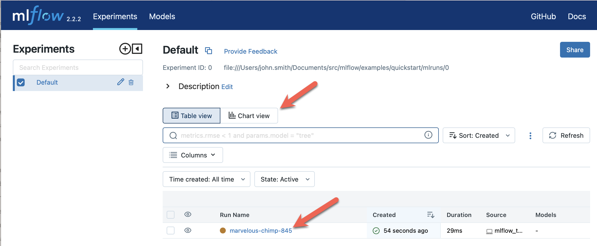
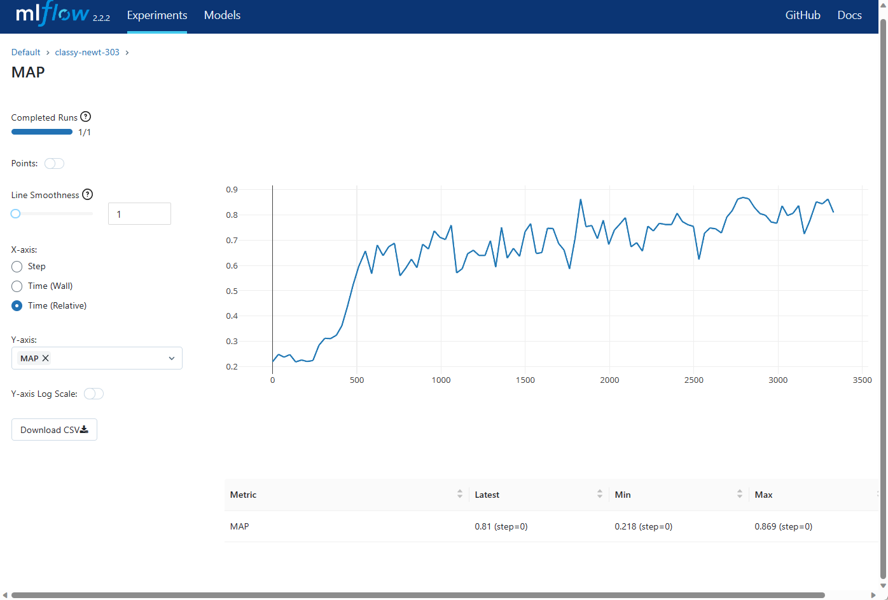

# Quickstart: Install MLflow, instrument code & view results in minutes {#quickstart-1}

In less than 15 minutes, you will:

-   Install MLflow
-   Add MLflow tracking to your code
-   View runs and experiments in the MLflow tracking UI
-   (Optional) Run a tracking server to share results with others
-   (Optional) Use Databricks to store your results
-   Store the models produced by your runs
-   Load a model from a previous run for inference

As a data scientist, your explorations involve running your evolving
training code many times. MLflow Tracking allows you to record important
information your run, review and compare it with other runs, and share
results with others. As an ML Engineer or MLOps professional, it allows
you to compare, share, and deploy the best models produced by the team.

{.align-center
width="800px"}

MLflow is available for Python, R, and Java, but this quickstart shows
Python only. For Java, see `java_api`{.interpreted-text role="ref"}. For
R, see `R-api`{.interpreted-text role="ref"}.

## Install MLflow

Install MLflow from PyPI using pip:

::: code-section
``` shell
pip install mlflow
```
:::

For more options, see `quickstart_drilldown_install`{.interpreted-text
role="ref"}.

## Add MLflow tracking to your code

For many popular ML libraries, you make a single function call:
`mlflow.autolog()`. If you are using one of the supported libraries,
this will automatically log the parameters, metrics, and artifacts of
your run (see list at `automatic-logging`{.interpreted-text
role="ref"}). For instance, the following autologs a **scikit-learn**
run:

::: code-section
``` python
import mlflow

from sklearn.model_selection import train_test_split
from sklearn.datasets import load_diabetes
from sklearn.ensemble import RandomForestRegressor

mlflow.autolog()

db = load_diabetes()
X_train, X_test, y_train, y_test = train_test_split(db.data, db.target)

# Create and train models.
rf = RandomForestRegressor(n_estimators=100, max_depth=6, max_features=3)
rf.fit(X_train, y_train)

# Use the model to make predictions on the test dataset.
predictions = rf.predict(X_test)
```
:::

In addition, or if you are using a library for which `autolog` is not
yet supported, you may use key-value pairs to track:

  -------------------------------------------------------------------------------------
  Name         Used for        Function call
  ------------ --------------- --------------------------------------------------------
  Parameters   Constant values `mlflow.log_param`, `mlflow.log_params`
               (for instance,  
               configuration   
               parameters)     

  Metrics      Values updated  `mlflow.log_metric`
               during the run  
               (for instance,  
               accuracy)       

  Artifacts    Files produced  `mlflow.log_artifacts`, `mlflow.log_image`,
               by the run (for `mlflow.log_text`
               instance, model 
               weights)        
  -------------------------------------------------------------------------------------

This example demonstrates the use of these functions:

::: code-section
.. code-block:: python

```python```
import os
from random import random, randint 
from mlflow import log_metric, log_param, log_params, log_artifacts

if \_\_name\_\_ == \"\_\_main\_\_\":

:   \# Log a parameter (key-value pair) log_param(\"config_value\",
    randint(0, 100))

    \# Log a dictionary of parameters log_params({\"param1\": randint(0,
    100), \"param2\": randint(0, 100)})

    \# Log a metric; metrics can be updated throughout the run
    log_metric(\"accuracy\", random() / 2.0) log_metric(\"accuracy\",
    random() + 0.1) log_metric(\"accuracy\", random() + 0.2)

    \# Log an artifact (output file) if not os.path.exists(\"outputs\"):
    os.makedirs(\"outputs\") with open(\"outputs/test.txt\", \"w\") as
    f: f.write(\"hello world!\") log_artifacts(\"outputs\")
:::

If you are using a library that supports autologging, but wish to
disable it, you may do so by calling `mlflow.autolog(disable=True)`.

-   For more details on automatic logging, see
    `automatic-logging`{.interpreted-text role="ref"}.
-   For more details on the explicit logging API, see
    `tracking_logging_functions`{.interpreted-text role="ref"}.

## View MLflow runs and experiments

Once you\'ve run your code, you may view the results with MLflow\'s
tracking UI. To start the UI, run:

::: code-section
``` shell
mlflow ui
```
:::

And then navigate to <http://localhost:5000> in your browser. You will
see a page similar to:

{.align-center
width="800px"}

You are in the **Default** experiment, which now contains the tracking
data for your run. An experiment is a collection of related runs. The
MLflow UI opens to the **Table view**. The main portion of the window
shows a table of runs, with each row representing a single run. The
columns show the run name, how long ago it was created, its running
time, and so forth. If you select a run name, you will open details for
the run, which shows the parameters, metrics, and artifacts of the run.

{.align-center
width="800px"}

You can view the history of a metric by opening Metrics and selecting
the metric name. For instance, the following image shows a run\'s Mean
Average Precision over time:

{.align-center
width="800px"}

From the main page, you can switch between **Table view** and **Chart
view**. **Chart view** allows you to compare runs at a glance. For
instance, the following image shows the Mean Average Precision of the
highest-scoring runs in this experiment:

{.align-center
width="800px"}

For more details on the tracking UI, see `tracking`{.interpreted-text
role="ref"}.

## Share MLflow runs and experiments {#quickstart_tracking_server}

For getting started, the last example stored the tracking data locally.
Generally, you will want to use shared storage. Locally, MLflow stores
tracking data and artifacts in an **mlruns/** subdirectory of where you
ran the code. The tracking UI, when run locally, visualizes this.

You may also store your data remotely. You can track your runs with a
tracking server, on a shared filesystem, with a SQLAlchemy-compatible
database, or in a Databricks workspace. To do so:

-   Call `mlflow.set_tracking_uri` in your code; or
-   Set the `MLFLOW_TRACKING_URI` environment variable

A tracking server is a lightweight HTTP server built in to MLflow. You
can run a tracking server on a network-accessible server by running:

::: code-section
``` shell
mlflow server
```
:::

For instance, if you\'ve run the above command on a machine with IP
address **192.168.0.1** and port **5000**, you can add tracking data to
it either by:

::: code-section
``` python
mlflow.set_tracking_uri("http://192.168.0.1:5000")
mlflow.autolog()  # Or other tracking functions
```
:::

Or, on your development machine, you can set the `MLFLOW_TRACKING_URI`
environment variable to the URL of that server:

::: code-section
``` shell
export MLFLOW_TRACKING_URI=http://192.168.0.1:5000
```
:::

Now, when you run your code, it will send tracking data to the tracking
server. You can view the tracking data by navigating to the URI with a
browser.

There are many options available for the tracking backend. For more
details, see `tracking_server`{.interpreted-text role="ref"}.

### Use MLflow with a Databricks workspace

You need to configure MLflow to use your Databricks workspace (To get
started with Databricks, see: [Get started: Account and Workspace
setup](https://docs.databricks.com/getting-started/index.html)). You
will need to know the URL of your Databricks workspace. You can find the
URL in the Configuration page of the workspace:

{.align-center
width="800px"}

At the command-line, run the following command to configure your
experiment:

::: code-section
``` shell
databricks configure
```
:::

Set the `Databricks Host` to the URL of your Databricks workspace, and
set the `Username` and `Password` to the credentials you use to access
the workspace. If you\'ve created an authentication token for your
Databricks workspace (`databricks tokens create`), you can use it
instead of your password. Call `databricks configure` with the
`-t, \--token` option.

In your training code, modify the call to `mlflow.set_tracking_uri` to
use Databricks and set the experiment to the path of your experiment in
Databricks, replacing `user_name` and `experiment_name` with the
appropriate values:

::: code-section
``` python
mlflow.set_tracking_uri("databricks")
mlflow.set_experiment(f"/Users/{user_name}/{experiment_name}")
```
:::

If the specified experiment does not exist, it will be created.

For more on using MLflow with Databricks, see [Databricks\'
documentation on MLflow](https://docs.databricks.com/mlflow/index.html).

## Store a model in MLflow

An MLflow Model is a directory that packages machine learning models and
support files in a standard format. The directory contains:

-   An **MLModel** file in YAML format specifying the model\'s
    **flavor** (or **flavors**), dependencies, signature (if supplied),
    and important metadata;
-   The various files required by the model\'s flavor(s) to instantiate
    the model. This will often be a serialized Python object;
-   Files necessary for recreating the model\'s runtime environment (for
    instance, a **conda.yaml** file); and
-   Optionally, an input example

When using autologging, MLflow will automatically log whatever model or
models the run creates. You can also log a model manually by calling
`mlflow.{library_module_name}.log_model`. In addition, if you wish to
load the model soon, it may be convenient to output the run\'s ID
directly to the console. For that, you\'ll need the object of type
`mlflow.ActiveRun` for the current run. You get that object by wrapping
all of your logging code in a `with mlflow.start_run() as run:` block.
(`mlflow.start_run`{.interpreted-text role="py:func"} API reference)

For example:

::: code-section
``` python
import mlflow
from mlflow.models import infer_signature

from sklearn.model_selection import train_test_split
from sklearn.datasets import load_diabetes
from sklearn.ensemble import RandomForestRegressor

with mlflow.start_run() as run:
    # Load the diabetes dataset.
    db = load_diabetes()
    X_train, X_test, y_train, y_test = train_test_split(db.data, db.target)

    # Create and train models.
    rf = RandomForestRegressor(n_estimators=100, max_depth=6, max_features=3)
    rf.fit(X_train, y_train)

    # Use the model to make predictions on the test dataset.
    predictions = rf.predict(X_test)
    print(predictions)

    signature = infer_signature(X_test, predictions)
    mlflow.sklearn.log_model(rf, "model", signature=signature)

    print(f"Run ID: {run.info.run_id}")
```
:::

In the case of the `sklearn` flavor, `log_model` stores the following
files in the **artifacts** directory of the run\'s directory on the
tracking server:

::: code-section
``` shell
model/
|-- MLmodel
|-- conda.yaml
|-- model.pkl
|-- python_env.yaml
|-- requirements.txt
```
:::

If you\'ve not called `set_tracking_uri` or set the
`MLFLOW_TRACKING_URI` environment variable to point to a remote tracking
server, this **model** directory will be under the **mlruns** directory.

For more information, including a list of supported model flavors and
storing your own flavor, see
`models_built-in-model-flavors`{.interpreted-text role="ref"}.

## Load a model from a specific training run for inference

To load and run a model stored in a previous run, you can use the
`mlflow.{library_module_name}.load_model` function. You\'ll need the run
ID of the run that logged the model. You can find the run ID in the
tracking UI:

{.align-center
width="400px"}

::: code-section
``` python
import mlflow

from sklearn.model_selection import train_test_split
from sklearn.datasets import load_diabetes

db = load_diabetes()
X_train, X_test, y_train, y_test = train_test_split(db.data, db.target)

model = mlflow.sklearn.load_model("runs:/d7ade5106ee341e0b4c63a53a9776231")
predictions = model.predict(X_test)
print(predictions)
```
:::

Note that while `log_model` saves environment-specifying files such as
**conda.yaml** and **requirements.txt**, `load_model` does not
automatically recreate that environment. To do so, you need to use your
preferred method (**conda**, **virtualenv**, **pip**, etc.), using the
artifacts saved by `log_model`.

If you serve your model with `mlflow models serve`, MLflow will
automatically recreate the environment. Those commands also accept an
`--env-manager` option for even more control. This is described in
detail in `model-enviroment-management`{.interpreted-text role="ref"}.

In the case of `mlflow.pyfunc.spark_udf()`, you can use the
`--env-manager` flag to recreate the environment during Spark batch
inference.
