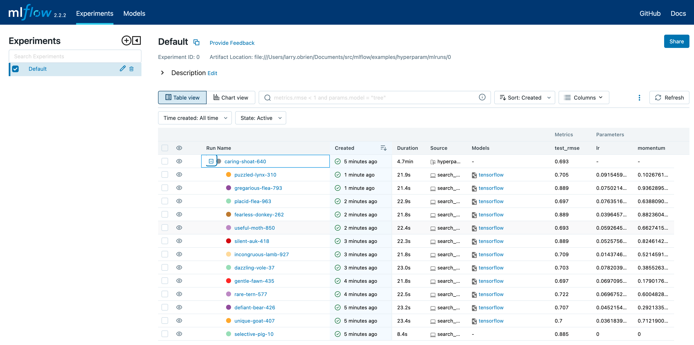
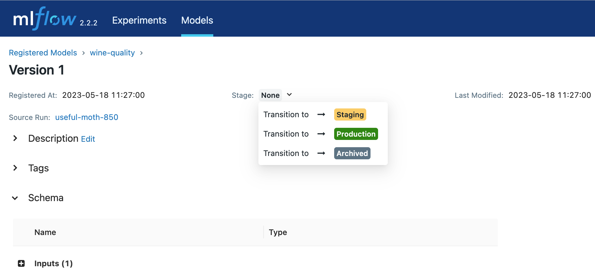

# Quickstart: Compare runs, choose a model, and deploy it to a REST API {#quickstart-mlops}

In this quickstart, you will:

-   Run a hyperparameter sweep on a training script
-   Compare the results of the runs in the MLflow UI
-   Choose the best run and register it as a model
-   Deploy the model to a REST API
-   Build a container image suitable for deployment to a cloud platform

As an ML Engineer or MLOps professional, you can use MLflow to compare,
share, and deploy the best models produced by the team. In this
quickstart, you will use the MLflow Tracking UI to compare the results
of a hyperparameter sweep, choose the best run, and register it as a
model. Then, you will deploy the model to a REST API. Finally, you will
create a Docker container image suitable for deployment to a cloud
platform.

## Set up {#set-up}

-   Install MLflow. See the `introductory quickstart <quickstart-1>` for
    instructions
-   Run the tracking server: `mlflow server`

## Run a hyperparameter sweep {#run-a-hyperparameter-sweep}

This example tries to optimize the RMSE metric of a Keras deep learning
model on a wine quality dataset. It has two hyperparameters that it
tries to optimize: `learning-rate` and `momentum`.

We will use the [Hyperopt](https://github.com/hyperopt/hyperopt) library
to run a hyperparameter sweep across different values of `learning-rate`
and `momentum` and record the results in MLflow.

Run the hyperparameter sweep, setting the `MLFLOW_TRACKING_URI`
environment variable to the URI of the MLflow tracking server:

~~~ bash
export MLFLOW_TRACKING_URI=http://localhost:5000
~~~

Import the following packages

~~~ python
import numpy as np
import pandas as pd
from hyperopt import STATUS_OK, Trials, fmin, hp, tpe
from sklearn.metrics import mean_squared_error
from sklearn.model_selection import train_test_split
from tensorflow.keras.layers import Dense, Lambda
from tensorflow.keras.models import Sequential
from tensorflow.keras.optimizers import SGD

import mlflow
from mlflow.models import infer_signature
~~~

Now load the dataset and split it into training, validation, and test
sets.

~~~ python
# Load dataset
data = pd.read_csv(
    "https://raw.githubusercontent.com/mlflow/mlflow/master/tests/datasets/winequality-white.csv",
    sep=";",
)

# Split the data into training, validation, and test sets
train, test = train_test_split(data, test_size=0.25, random_state=42)
train_x = train.drop(["quality"], axis=1).values
train_y = train[["quality"]].values.ravel()
test_x = test.drop(["quality"], axis=1).values
test_y = test[["quality"]].values.ravel()
train_x, valid_x, train_y, valid_y = train_test_split(
    train_x, train_y, test_size=0.2, random_state=42
)
signature = infer_signature(train_x, train_y)
~~~

Then, define the model architecture and train the model. The
`train_model` function uses MLflow to track the parameters, results, and
model itself of each trial as a child run.

~~~ python
def train_model(params, train_x, train_y, valid_x, valid_y, test_x, test_y, epochs):
    # Define model architecture
    model = Sequential()
    model.add(
        Lambda(lambda x: (x - np.mean(train_x, axis=0)) / np.std(train_x, axis=0))
    )
    model.add(Dense(64, activation="relu", input_shape=(train_x.shape[1],)))
    model.add(Dense(1))

    # Compile model
    model.compile(
        optimizer=SGD(lr=params["lr"], momentum=params["momentum"]),
        loss="mean_squared_error",
    )

    # Train model with MLflow tracking
    with mlflow.start_run(nested=True):
        # Fit model
        model.fit(
            train_x,
            train_y,
            validation_data=(valid_x, valid_y),
            epochs=epochs,
            verbose=0,
        )

        # Evaluate the model
        predicted_qualities = model.predict(test_x)
        rmse = np.sqrt(mean_squared_error(test_y, predicted_qualities))

        # Log parameters and results
        mlflow.log_params(params)
        mlflow.log_metric("rmse", rmse)

        # Log model
        mlflow.tensorflow.log_model(model, "model", signature=signature)

        return {"loss": rmse, "status": STATUS_OK, "model": model}
~~~

The `objective` function takes in the hyperparameters and returns the
results of the `train_model` function for that set of hyperparameters.

~~~ python
def objective(params):
    # MLflow will track the parameters and results for each run
    result = train_model(
        params,
        train_x=train_x,
        train_y=train_y,
        valid_x=valid_x,
        valid_y=valid_y,
        test_x=test_x,
        test_y=test_y,
        epochs=32,  # Or any other number of epochs
    )
    return result
~~~

Next, we will define the search space for Hyperopt. In this case, we
want to try different values of `learning-rate` and `momentum`.

~~~ python
space = {
    "lr": hp.loguniform("lr", np.log(1e-5), np.log(1e-1)),
    "momentum": hp.uniform("momentum", 0.0, 1.0),
}
~~~

Finally, we will run the hyperparameter sweep using Hyperopt, passing in
the `objective` function and search space. Hyperopt will try different
hyperparameter combinations and return the results of the best one. We
will store the best parameters, model, and rmse in MLflow.

~~~ python
with mlflow.start_run():
    # Conduct the hyperparameter search using Hyperopt
    trials = Trials()
    best = fmin(
        fn=objective,
        space=space,
        algo=tpe.suggest,
        max_evals=12,  # Set to a higher number to explore more hyperparameter configurations
        trials=trials,
    )

    # Fetch the details of the best run
    best_run = sorted(trials.results, key=lambda x: x["loss"])[0]

    # Log the best parameters, loss, and model
    mlflow.log_params(best)
    mlflow.log_metric("rmse", best_run["loss"])
    mlflow.tensorflow.log_model(best["model"], "model", signature=signature)

    # Print out the best parameters and corresponding loss
    print(f"Best parameters: {best}")
    print(f"Best rmse: {best_run['loss']}")
~~~

## Compare the results {#compare-the-results}

Open the MLflow UI in your browser at the
MLFLOW_TRACKING_URI. You should see a
nested list of runs. In the default **Table view**, choose the
**Columns** button and add the **Metrics \| test_rmse** column and the
**Parameters \| lr** and **Parameters \| momentum** column. To sort by
RMSE ascending, click the **test_rmse** column header. The best run
typically has an RMSE on the **test** dataset of ~0.70. You can see the
parameters of the best run in the **Parameters** column.

Choose **Chart view**. Choose the **Parallel coordinates** graph and
configure it to show the **lr** and **momentum** coordinates and the
**test_rmse** metric. Each line in this graph represents a run and
associates each hyperparameter evaluation run's parameters to the
evaluated error metric for the run.

The red graphs on this graph are runs that fared poorly. The lowest one
is a baseline run with both **lr** and **momentum** set to 0.0. That
baseline run has an RMSE of ~0.89. The other red lines show that high
**momentum** can also lead to poor results with this problem and
architecture.

The graphs shading towards blue are runs that fared better. Hover your
mouse over individual runs to see their details.

## Register your best model {#register-your-best-model}

Choose the best run and register it as a model. In the **Table view**,
choose the best run. In the **Run Detail** page, open the **Artifacts**
section and select the **Register Model** button. In the **Register
Model** dialog, enter a name for the model, such as `wine-quality`, and
click **Register**.

Now, your model is available for deployment. You can see it in the
**Models** page of the MLflow UI. Open the page for the model you just
registered.

You can add a description for the model, add tags, and easily navigate
back to the source run that generated this model. You can also
transition the model to different stages. For example, you can
transition the model to **Staging** to indicate that it is ready for
testing. You can transition it to **Production** to indicate that it is
ready for deployment.

Transition the model to **Staging** by choosing the **Stage** dropdown:

## Serve the model locally {#serve-the-model-locally}

MLflow allows you to easily serve models produced by any run or model
version. You can serve the model you just registered by running:

~~~ bash
mlflow models serve -m "models:/wine-quality/Staging" --port 5002
~~~

(Note that specifying the port as above will be necessary if you are
running the tracking server on the same machine at the default port of
**5000**.)

You could also have used a `runs:/<run_id>` URI to serve a model, or any
supported URI described in `artifact-stores`.

To test the model, you can send a request to the REST API using the
`curl` command:

~~~ bash
curl -d '{"dataframe_split": { 
"columns": ["fixed acidity","volatile acidity","citric acid","residual sugar","chlorides","free sulfur dioxide","total sulfur dioxide","density","pH","sulphates","alcohol"], 
"data": [[7,0.27,0.36,20.7,0.045,45,170,1.001,3,0.45,8.8]]}}' \
-H 'Content-Type: application/json' -X POST localhost:5002/invocations
~~~

Inferencing is done with a JSON POST
request to the **invocations** path on **localhost** at the specified
port. The `columns` key specifies the names of the columns in the input
data. The `data` value is a list of lists, where each inner list is a
row of data. For brevity, the above only requests one prediction of wine
quality (on a scale of 3-8). The response is a JSON object with a
**predictions** key that contains a list of predictions, one for each
row of data. In this case, the response is:

~~~ json
{"predictions": [{"0": 5.310967445373535}]}
~~~

The schema for input and output is available in the MLflow UI in the
**Artifacts \| Model** description. The schema is available because the
`train.py` script used the `mlflow.infer_signature` method and passed
the result to the `mlflow.log_model` method. Passing the signature to
the `log_model` method is highly recommended, as it provides clear error
messages if the input request is malformed.

## Build a container image for your model {#build-a-container-image-for-your-model}

Most routes toward deployment will use a container to package your
model, its dependencies, and relevant portions of the runtime
environment. You can use MLflow to build a Docker image for your model.

~~~ bash
mlflow models build-docker --model-uri "models:/wine-quality/1" --name "qs_mlops"
~~~

This command builds a Docker image named `qs_mlops` that contains your
model and its dependencies. The `model-uri` in this case specifies a
version number (`/1`) rather than a lifecycle stage (`/staging`), but
you can use whichever integrates best with your workflow. It will take
several minutes to build the image. Once it completes, you can run the
image to provide real-time inferencing locally, on-prem, on a bespoke
Internet server, or cloud platform. You can run it locally with:

~~~ bash
docker run -p 5002:8080 qs_mlops
~~~

This [Docker run
command](https://docs.docker.com/engine/reference/commandline/run/) runs
the image you just built and maps port **5002** on your local machine to
port **8080** in the container. You can now send requests to the model
using the same `curl` command as before:

~~~ bash
curl -d '{"dataframe_split": {"columns": ["fixed acidity","volatile acidity","citric acid","residual sugar","chlorides","free sulfur dioxide","total sulfur dioxide","density","pH","sulphates","alcohol"], "data": [[7,0.27,0.36,20.7,0.045,45,170,1.001,3,0.45,8.8]]}}' -H 'Content-Type: application/json' -X POST localhost:5002/invocations
~~~

## Deploying to a cloud platform {#deploying-to-a-cloud-platform}

Virtually all cloud platforms allow you to deploy a Docker image. The
process varies considerably, so you will have to consult your cloud
provider's documentation for details.

In addition, some cloud providers have built-in support for MLflow. For
instance:

-   [Azure ML](https://learn.microsoft.com/azure/machine-learning/)
-   [Databricks](https://www.databricks.com/product/managed-mlflow)
-   [Amazon SageMaker](https://docs.aws.amazon.com/sagemaker/index.html)
-   [Google Cloud](https://cloud.google.com/doc)

all support MLflow. Cloud platforms generally support multiple workflows
for deployment: command-line, SDK-based, and Web-based. You can use
MLflow in any of these workflows, although the details will vary between
platforms and versions. Again, you will need to consult your cloud
provider's documentation for details.
