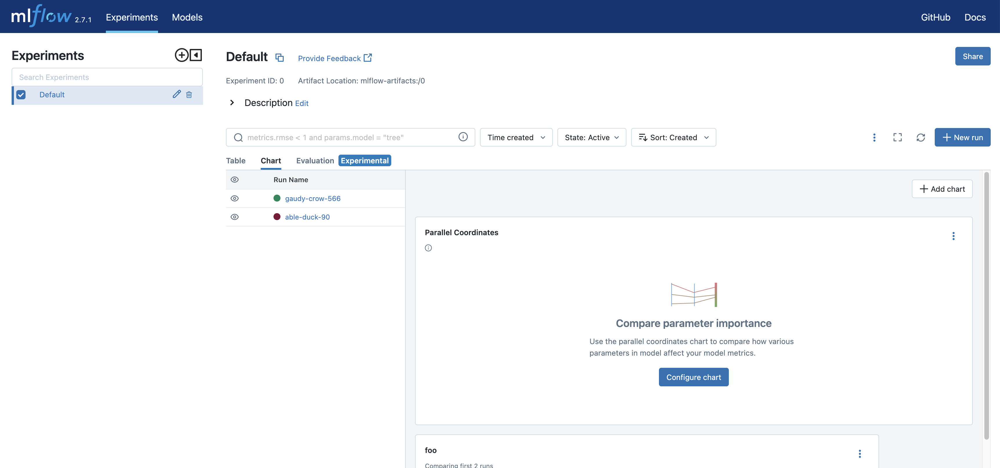
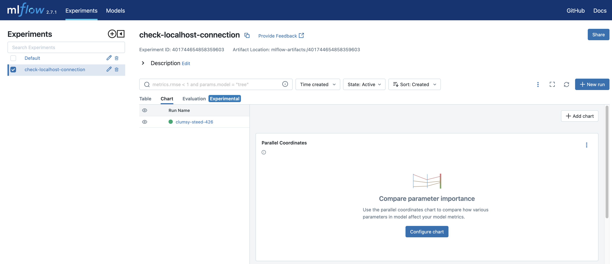
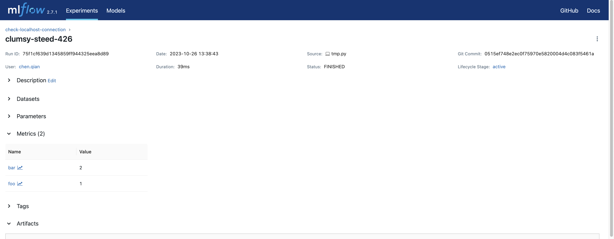
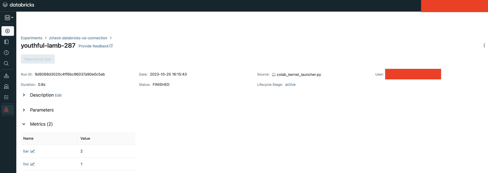

# 5 Minute Tracking Server Overview {#tracking-server-overview}

In this guide we will walk you through how to view your MLflow
experiment results with different types of tracking server
configurations. At a high level, there are 3 ways to view your MLflow
experiments:

-   **\[Method 1\]** Start your own MLflow server.
-   **\[Method 2\]** Use a free hosted tracking server - Databricks
    Community Edition.
-   **\[Method 3\]** Use production Databricks/AzureML.

To choose among these 3 methods, here is our recommendation:

-   If you have privacy concerns (data/model/tech stack), use **Method
    1 - start your own server**.
-   If you are a student or an individual researcher, or if you are
    developing in cloud-based notebooks (e.g., Google Colab), use
    **Method 2 - free hosted tracking server**.
-   Enterprise users, or if you want to serve or deploy your model for a
    production use-case, please use **Method 3 - production
    Databricks/AzureML**.

Overall **Method 2 - free hosted tracking server** is the simplest way
to get started with MLflow, but please pick the method that best suits
your needs.

## Method 1: Start Your Own MLflow Server {#method-1-start-your-own-mlflow-server}

**Disclaimier**: This part of guide is not suitable for running in a
cloud-provided IPython environment (e.g., Collab, Databricks). Please
follow the guide below in your local machine (laptop/desktop).

A hosted tracking server is the simplest way to store and view MLflow
experiments, but it is not suitable for every user. For example, you may
not want to expose your data and model to others in your cloud provider
account. In this case, you can use a local hosted MLflow server to store
and view your experiments. To do so, there are two steps:

-   Start your MLflow server.
-   Connect MLflow session to the local MLflow server IP by
    `mlflow.set_tracking_uri()`.

### Start a Local MLflow Server {#start-a-local-mlflow-server}

If you don't have MLflow installed, please run the command below to
install it:

~~~ bash
$ pip install mlflow
~~~

The installation of MLflow includes the MLflow CLI tool, so you can
start a local MLflow server with UI by running the command below in your
terminal:

~~~ bash
$ mlflow ui
~~~

It will generate logs with the IP address, for example:

~~~ bash
(mlflow) [master][~/Documents/mlflow_team/mlflow]$ mlflow ui
[2023-10-25 19:39:12 -0700] [50239] [INFO] Starting gunicorn 20.1.0
[2023-10-25 19:39:12 -0700] [50239] [INFO] Listening at: http://127.0.0.1:5000 (50239)
~~~

Opening the URL of the MLflow tracking server in your browser will bring
you to the MLflow UI. The image below is from the open source version of
the MLflow UI, which is a bit different from the MLflow UI on Databricks
CE. Below is a screenshot of the landing page:

Note

It's also possible to deploy your own MLflow server on cloud platforms,
but it is out of the scope of this guide.

### Connect MLflow Session to Your Server {#connect-mlflow-session-to-your-server}

Now that the server is spun up, let's connect our MLflow session to the
local server. This is very similar to how we connect to a remote hosted
tracking provider such as the Databricks platform.

~~~ python
mlflow.set_tracking_uri("http://localhost:5000")
~~~

Next, let's try logging some dummy metrics. We can view these test
metrics on the local hosted UI:

~~~ python
mlflow.set_experiment("/check-localhost-connection")

with mlflow.start_run():
    mlflow.log_metric("foo", 1)
    mlflow.log_metric("bar", 2)
~~~

Putting it together you can copy the following code to your editor and
save it as \`log_mlflow_with_localhost.py\`:

~~~ python
import mlflow

mlflow.set_tracking_uri("http://localhost:5000")
mlflow.set_experiment("check-localhost-connection")

with mlflow.start_run():
    mlflow.log_metric("foo", 1)
    mlflow.log_metric("bar", 2)
~~~

Then execute it by:

~~~ bash
$ python log_mlflow_with_localhost.py
~~~

### View Experiment on Your MLflow Server {#view-experiment-on-your-mlflow-server}

Now let's view your experiment on the local server. Open the URL in your
browser, which is http://localhost:5000
in our case. In the UI, inside the left sidebar you should see the
experiment with name
"check-localhost-connection". Clicking on
this experiment name should bring you to the experiment view, similar to
what is shown below.

Clicking on the run ("clumsy-steed-426"
in this example, yours will be different) will bring you to the run
view, similar as below.

### Conclusion {#conclusion}

That's all about how to start your own MLflow server and view your
experiments. Please see the pros and cons of this method below:

-   **Pros**
    -   You have full control of your data and model, which is good for
        privacy concerns.
    -   No subscription is required.
    -   Unlimited quota of experiments/runs.
    -   You can even customize your UI by forking the MLflow repo and
        modify the UI code.
-   **Cons**
    -   Requires manual setup and maintenance.
    -   Team collaboration is harder than using a hosted tracking
        server.
    -   Not suitable for cloud-based notebook, e.g., Google Colab.
    -   Requires extra port forwarding if you deploy your server on
        cloud VM.
    -   No serving support.

## Method 2: Use Free Hosted Tracking Server (Databricks Community Edition) {#method-2-use-free-hosted-tracking-server-databricks-community-edition}

**Notice**: This part of guide can be directly executed in cloud-based
notebook, e.g., Google Colab or Databricks Notebook.

[Databricks Community Edition
(CE)](https://community.cloud.databricks.com/) is the free, limited-use
version of the cloud-based big data platform Databricks. Databricks CE
users can access a micro-cluster as well as a cluster manager and
notebook environment. All users can share their notebooks and host them
free of charge with Databricks. You can use Databricks CE to store and
view your MLflow experiments without being charged.

To use Databricks CE to store and view our MLflow experiments, basically
we need to:

-   Create a free Databricks CE account.
-   Set up Databricks CE authentication in our dev environment.
-   Connect to Databricks CE in our MLflow experiment session.

Then the experiment results will be automatically sent to Databricks CE,
where you can view it in MLflow experiment UI. Now let's look at the
code.

### Create a Databricks CE Account {#create-a-databricks-ce-account}

If you don't have an account of Databricks CE yet, you can create one
[here](https://www.databricks.com/try-databricks#account). The full
process should take no longer than 3 minutes.

### Install Dependencies {#install-dependencies}

~~~ bash
!pip install -q mlflow databricks-sdk
~~~

### Set Up Authentication of Databricks CE {#set-up-authentication-of-databricks-ce}

To set up Databricks CE authentication, we can use the API
`mlflow.login()`, which will prompt you for required information:

-   **Databricks Host**: Use <https://community.cloud.databricks.com/>
-   **Username**: Your email address that signs in Databricks CE.
-   **Password**: Your password of Databricks CE.

If the authentication succeeds, you should see a message "Succesfully
signed in Databricks!".

~~~ python
import mlflow

mlflow.login()
~~~

~~~ text
2023/10/25 22:59:27 ERROR mlflow.utils.credentials: Failed to sign in Databricks: default auth: cannot configure default credentials
Databricks Host (should begin with https://): https://community.cloud.databricks.com/
Username: weirdmouse@gmail.com
Password: ··········
2023/10/25 22:59:38 INFO mlflow.utils.credentials: Succesfully signed in Databricks!
~~~

### Connect MLflow Session to Databricks CE {#connect-mlflow-session-to-databricks-ce}

We have set up the credentials, now we need to tell MLflow to send the
data into Databricks CE. To do so, we will use
`mlflow.set_tracking_uri("databricks")` to port MLflow to Databricks CE.
Basically it is the command below. Please note that you need to always
use "databricks" as the keyword.

~~~ python
mlflow.set_tracking_uri("databricks")
~~~

Now you are ready to go! Let's try starting an MLflow experiment and log
some dummy metrics and view it in our UI.

~~~ python
mlflow.set_experiment("/check-databricks-connection")

with mlflow.start_run():
    mlflow.log_metric("foo", 1)
    mlflow.log_metric("bar", 2)
~~~

~~~ text
2023/10/25 23:15:42 INFO mlflow.tracking.fluent: Experiment with name '/check-databricks-ce-connection' does not exist. Creating a new experiment.
~~~

### View Your Experiment on Databricks CE {#view-your-experiment-on-databricks-ce}

Now let's navigate to Databricks CE to view the experiment result. Log
in to your [Databricks CE](https://community.cloud.databricks.com/)
account, and click on top left to select machine learning in the drop
down list. Then click on the experiment icon. See the screenshot below:

In the "Experiments" view, you should be able to find the experiment
"/check-databricks-ce-connection", similar to

Clicking on the run name, in our example it is "youthful-lamb-287" (it's
a randomly generated name, you will see a different name in your CE
console), will bring you to the run view, similar to

In the run view, you will see our dummy metrics
"foo" and
"bar" are logged successfully.

### Conclusion {#conclusion-1}

That's all about how to use Databricks CE as the tracking server. Please
see the pros and cons of this method below:

-   **Pros**
    -   Effortless setup.
    -   Free.
    -   Good for collaboration, e.g., you can share your MLflow
        experiment with your teammates easily.
    -   Compatible for developing on cloud-based notebook, e.g., Google
        Colab.
    -   Compatible for developing on cloud VM.
-   **Cons**
    -   Has quota limit of experiments/runs.
    -   No model registration/serving support.

## Method 3: Use Production Hosted Tracking Server {#method-3-use-production-hosted-tracking-server}

If you are an enterprise user and willing to productionize your model,
you can use a production platform like Databricks or Microsoft AzureML.
If you use Databricks, MLflow experiment will log your model into the
Databricks MLflow server, and you can register your model then serve
your model by a few clicks. Serving feature is only available on
production Databricks workspace, and not available on Databricks CE.

The method of using production Databricks is the same as using
Databricks CE, you only need to change the host to be the production
workspace. For example, `https://dbc-1234567-123.cloud.databricks.com`.
For more information about how Databricks power your Machine Learning
workflow, please refer to the [doc
here](https://docs.databricks.com/en/machine-learning/index.html).

To use AzureML as the tracking server, please read [the doc
here](https://learn.microsoft.com/en-us/azure/machine-learning/how-to-use-mlflow-cli-runs?view=azureml-api-2&tabs=interactive%2Ccli)

### Conclusion {#conclusion-2}

That's all about how to use a production platform as the tracking
server. Please see the pros and cons of this method below:

-   **Pros**
    -   Effortless setup.
    -   Good for collaboration, e.g., you can share your MLflow
        experiment with your teammates easily.
    -   Compatible for developing on cloud-based notebook, e.g., Google
        Colab.
    -   Compatible for developing on cloud VM.
    -   Seamless model registration/serving support.
    -   Higher quota than Databricks CE (pay as you go).
-   **Cons**
    -   Not free.
    -   Need to manage a billing account.
