# Prompt Engineering UI (Experimental) {#prompt-engineering}

Starting in MLflow 2.7, the MLflow Tracking UI provides a best-in-class
experience for prompt engineering. With no code required, you can try
out multiple LLMs from the `AI Gateway <gateway>`, parameter
configurations, and prompts to build a variety of models for question
answering, document summarization, and beyond. Using the embedded
Evaluation UI, you can also evaluate multiple models on a set of inputs
and compare the responses to select the best one. Every model created
with the prompt engineering UI is stored in the `MLflow Model <models>`
format and can be deployed for batch or real time inference. All
configurations (prompt templates, choice of LLM, parameters, etc.) are
tracked as `MLflow Runs <tracking>`.

## Quickstart {#prompt-engineering-quickstart}

The following guide will get you started with MLflow's UI for prompt
engineering.

### Step 1: Create an AI Gateway Completions or Chat Route {#step-1-create-an-ai-gateway-completions-or-chat-route}

To use the prompt engineering UI, you need to create one or more
`AI Gateway <gateway>` completions or chat `Routes <routes>`. Follow the
`AI Gateway Quickstart guide <gateway-quickstart>` to easily create a
Route in less than five minutes. If you already have access to an AI
Gateway Route of type `llm/v1/completions` or `llm/v1/chat`, you can
skip this step.

~~~ bash
mlflow gateway start --config-path config.yaml --port 7000
~~~

### Step 2: Connect the AI Gateway to your MLflow Tracking Server {#step-2-connect-the-ai-gateway-to-your-mlflow-tracking-server}

The prompt engineering UI also requires a connection between the AI
Gateway and the MLflow Tracking Server. To connect the AI Gateway with
the MLflow Tracking Server, simply set the `MLFLOW_GATEWAY_URI`
environment variable in the environment where the server is running and
restart the server. For example, if the AI Gateway is running at
`http://localhost:7000`, you can start an MLflow Tracking Server in a
shell on your local machine and connect it to the AI Gateway using the
`mlflow server <cli>` command as follows:

~~~ bash
export MLFLOW_GATEWAY_URI="http://localhost:7000"
mlflow server --port 5000
~~~

### Step 3: Create or find an MLflow Experiment {#step-3-create-or-find-an-mlflow-experiment}

Next, open an existing MLflow Experiment in the MLflow UI, or create a
new experiment.

<figure>
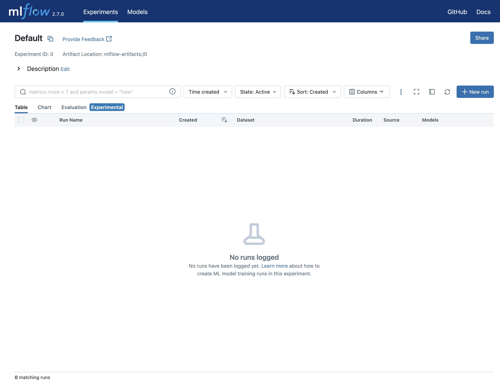
</figure>

### Step 4: Create a run with prompt engineering {#step-4-create-a-run-with-prompt-engineering}

Once you have opened the Experiment, click the **New Run** button and
select *using Prompt Engineering*. This will open the prompt engineering
playground where you can try out different LLMs, parameters, and
prompts.

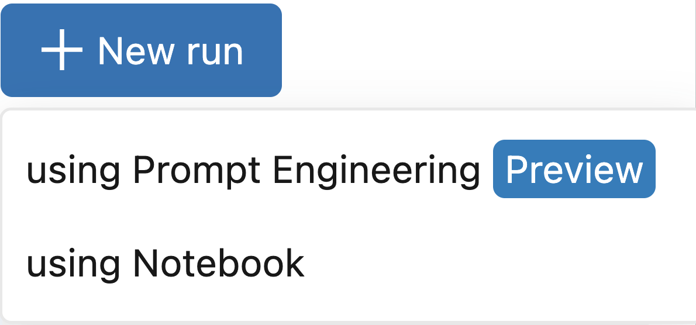
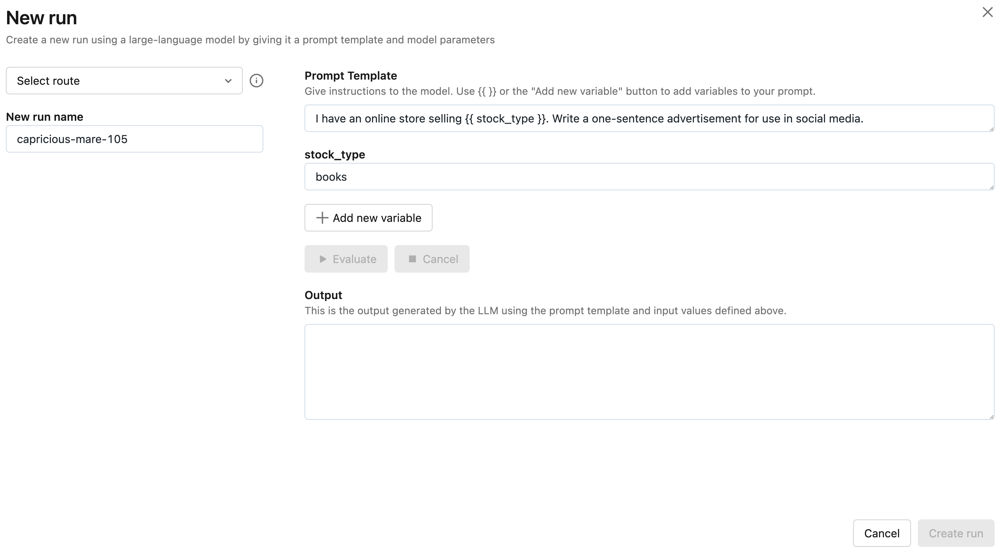

### Step 5: Select your Route and evaluate the example prompt {#step-5-select-your-route-and-evaluate-the-example-prompt}

Next, click the *Select route* dropdown and select the AI Gateway
completions Route you created in Step 1. Then, click the **Evaluate**
button to test out an example prompt engineering use case for generating
product advertisements.

MLflow will embed the specified *stock_type* input variable value -
`"books"` - into the specified *prompt template* and send it to the LLM
associated with the AI Gateway route with the configured *temperature*
(currently `0.01`) and *max_tokens* (currently 1000). The LLM response
will appear in the *Output* section.

<figure>
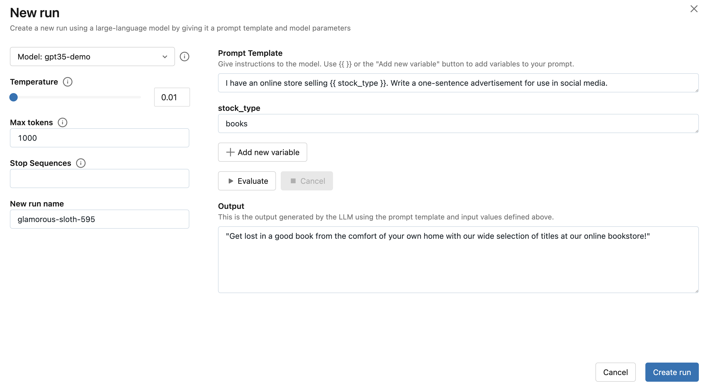
</figure>

### Step 6: Try a prompt of your choosing {#step-6-try-a-prompt-of-your-choosing}

Replace the prompt template from the previous step with a prompt
template of your choosing. Prompts can define multiple variables. For
example, you can use the following prompt template to instruct the LLM
to answer questions about the MLflow documentation:

~~~ 
Read the following article from the MLflow documentation that appears between triple
backticks. Then, answer the question about the documentation that appears between triple quotes.
Include relevant links and code examples in your answer.

```{{article}}```

"""
{{question}}
"""
~~~

Then, fill in the input variables. For example, in the MLflow
documentation use case, the *article* input variable can be set to the
contents of
<https://mlflow.org/docs/latest/tracking.html#logging-data-to-runs> and
the *question* input variable can be set to
`"How do I create a new MLflow Run using the Python API?"`.

Finally, click the **Evaluate** button to see the new output. You can
also try choosing a larger value of *temperature* to observe how the
LLM's output changes.

<figure>
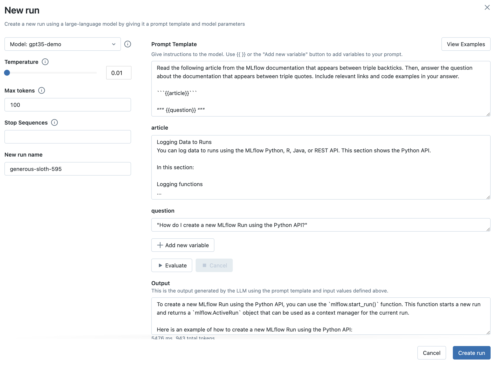
</figure>

### Step 7: Capture your choice of LLM, prompt template, and parameters as an MLflow Run {#step-7-capture-your-choice-of-llm-prompt-template-and-parameters-as-an-mlflow-run}

Once you're satisfied with your chosen prompt template and parameters,
click the **Create Run** button to store this information, along with
your choice of LLM, as an MLflow Run. This will create a new Run with
the prompt template, parameters, and choice of LLM stored as Run params.
It will also automatically create an MLflow Model with this information
that can be used for batch or real-time inference.

1.  To view this information, click the Run name to open the **Run**
    page:

    > <figure>
    > 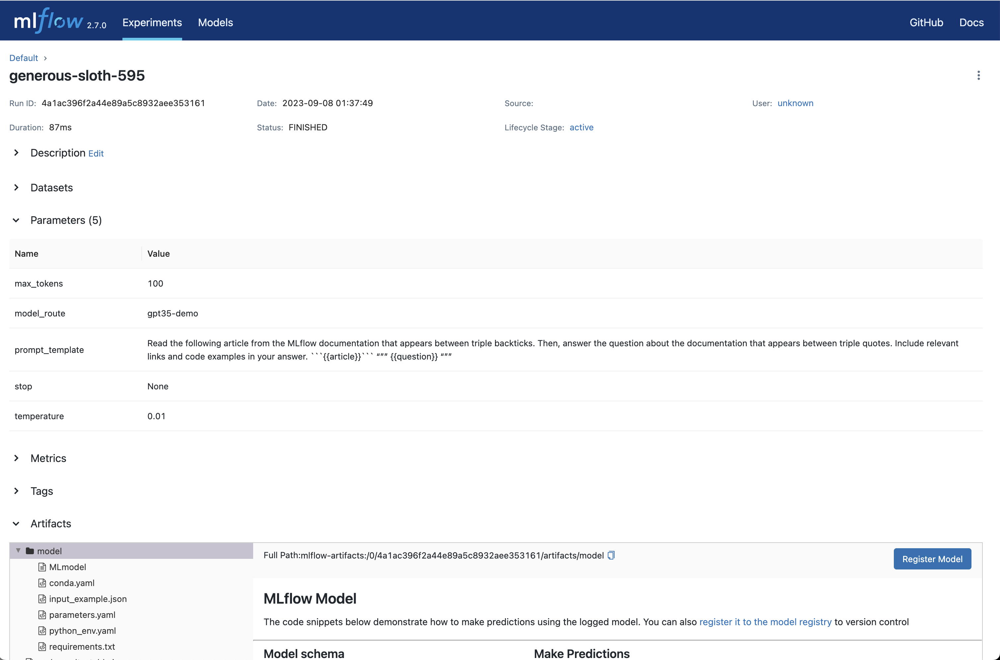 class="align-center"
    > alt="../../../static/images/prompt_eng_run_page.png" />
    > </figure>

2.  You can also see the parameters and compare them with other
    configurations by opening the **Table** view tab:

    > <figure>
    > 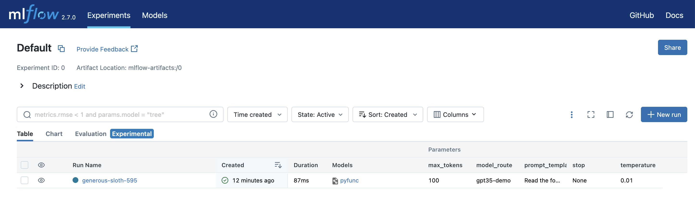 class="align-center"
    > alt="../../../static/images/prompt_eng_table_view.png" />
    > </figure>

3.  After your Run is created, MLflow will open the **Evaluation** tab
    where you can see your latest playground input & output and try out
    additional inputs:

    > <figure>
    > 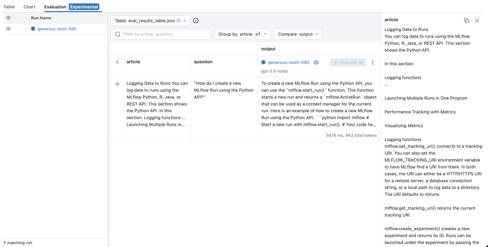 alt="../../../static/images/eval_view_1.png" />
    > </figure>

### Step 8: Try new inputs {#step-8-try-new-inputs}

To test the behavior of your chosen LLM, prompt template, and parameters
on a new inputs:

1.  Click the *Add Row* button and fill in a value(s) your prompt
    template's input variable(s). For example, in the MLflow
    documentation use case, you can try asking a question unrelated to
    MLflow to see how the LLM responds. This is important to ensure that
    the application is robust to irrelevant inputs.

2.  Then, click the **Evaluate** button to see the output.

    > <figure>
    > 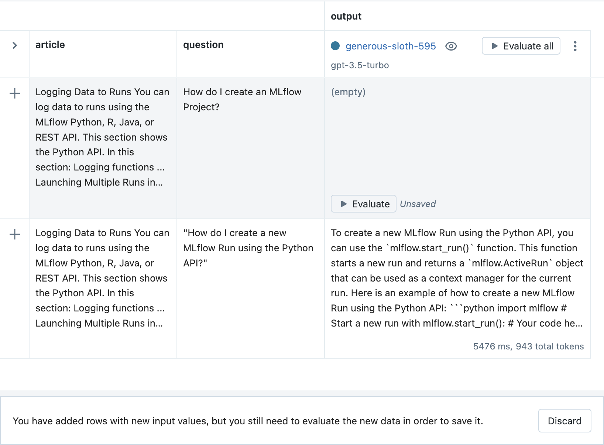 class="align-center"
    > alt="../../../static/images/evaluate_new_input.png" />
    > </figure>

3.  Finally, click the **Save** button to store the new inputs and
    output.

    > <figure>
    > 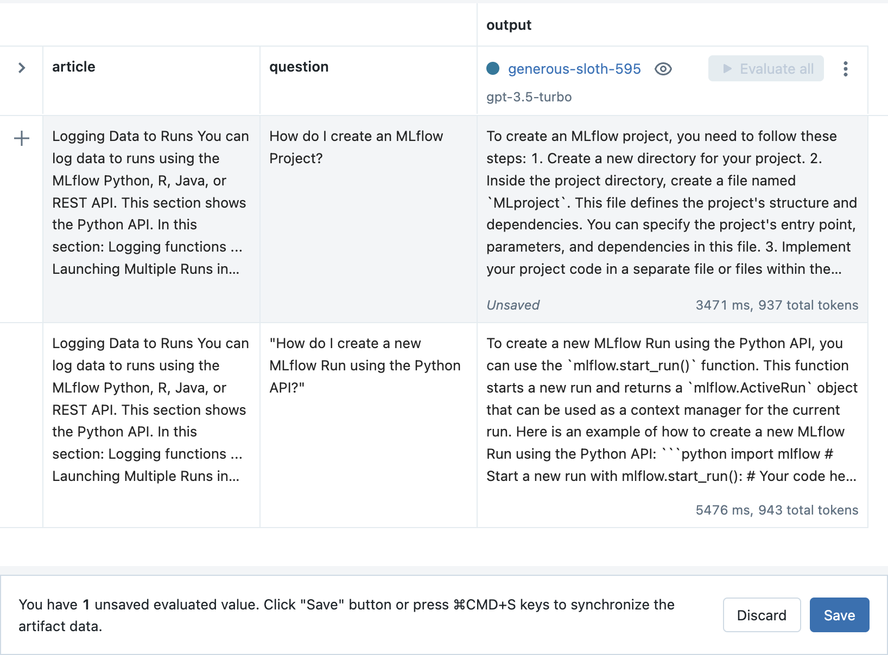 alt="../../../static/images/save_new_input.png" />
    > </figure>

### Step 9: Adjust your prompt template and create a new Run {#step-9-adjust-your-prompt-template-and-create-a-new-run}

As you try additional inputs, you might discover scenarios where your
choice of LLM, prompt template, and parameters doesn't perform as well
as you would like. For example, in the MLflow documentation use case,
the LLM still attempts to answer irrelevant questions about
`MLflow Projects <projects>` even if the answer does not appear in the
specified article.

1.  To improve performance, create a new Run by selecting the *Duplicate
    run* option from the context menu. For example, in the MLflow
    documentation use case, adding the following text to the prompt
    template helps improve robustness to irrelevant questions:

    ~~~ text
    If the question does not relate to the article, respond exactly with the phrase
    "I do not know how to answer that question." Do not include any additional text in your
    response.
    ~~~

    <figure>
    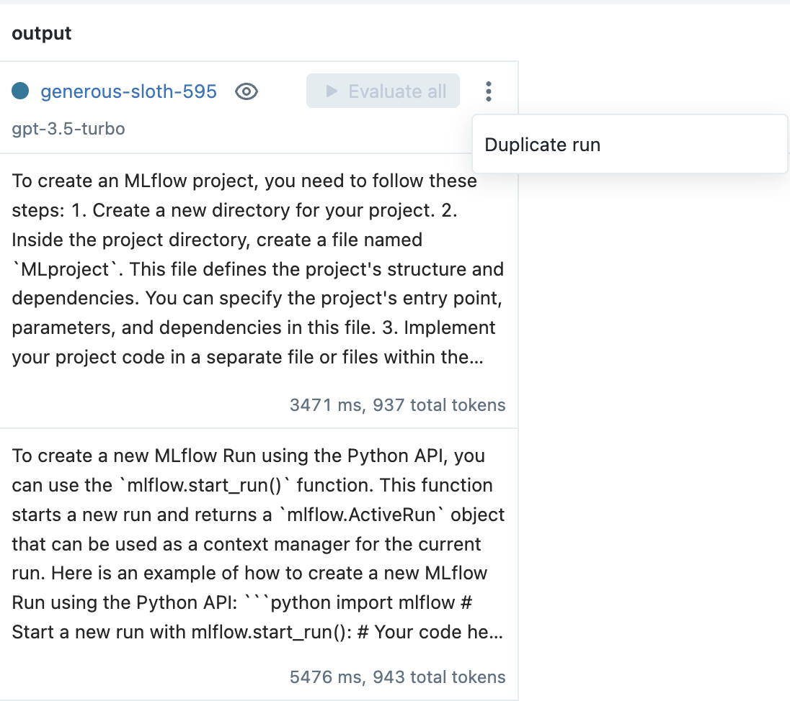
    </figure>

2.  Then, from the prompt engineering playground, adjust the prompt
    template (and / or choice of LLM and parameters), evaluate an input,
    and click the **Create Run** button to create a new Run.

    > <figure>
    > 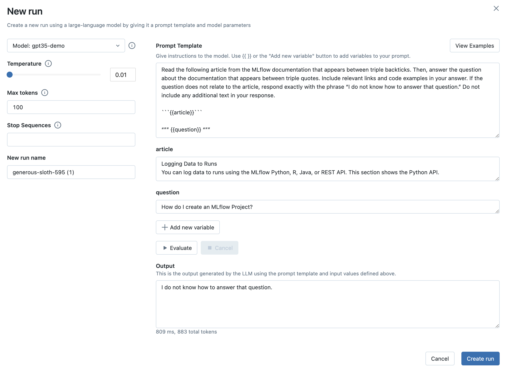 alt="../../../static/images/prompt_modal_4.png" />
    > </figure>

### Step 10: Evaluate the new prompt template on previous inputs {#step-10-evaluate-the-new-prompt-template-on-previous-inputs}

Now that you've made an adjustment to your prompt template, it's
important to make sure that the new template performs well on the
previous inputs and compare the outputs with older configurations.

1.  From the **Evaluation** tab, click the **Evaluate all** button next
    to the new Run to evaluate all of the previous inputs.

    <figure>
    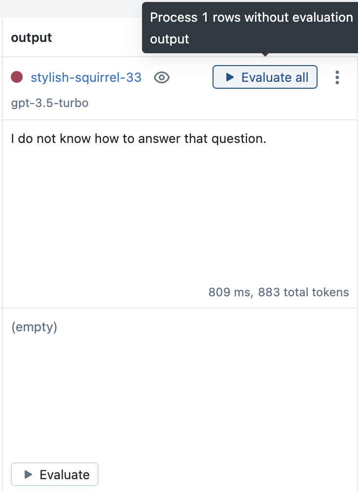
    </figure>

2.  Click the **Save** button to store the results.

    <figure>
    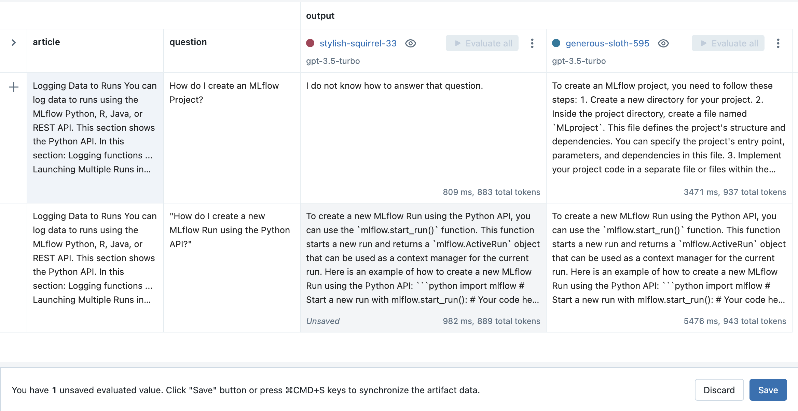
    </figure>

### Step 11: Load evaluation data programmatically {#step-11-load-evaluation-data-programmatically}

All of the inputs and outputs produced by the MLflow prompt engineering
UI and Evaluation UI are stored as artifacts in MLflow Runs. They can be
accessed programmatically using the `mlflow.load_table()` API as
follows:

> ~~~ python
> import mlflow
>
> mlflow.set_experiment("/Path/to/your/prompt/engineering/experiment")
>
> # Load input and output data across all Runs (configurations) as a Pandas DataFrame
> inputs_outputs_pdf = mlflow.load_table(
>     # All inputs and outputs created from the MLflow UI are stored in an artifact called
>     # "eval_results_table.json"
>     artifact_file="eval_results_table.json",
>     # Include the run ID as a column in the table to distinguish inputs and outputs
>     # produced by different runs
>     extra_columns=["run_id"],
> )
> # Optionally convert the Pandas DataFrame to Spark where it can be stored as a Delta
> # table or joined with existing Delta tables
> inputs_outputs_sdf = spark.createDataFrame(inputs_outputs_pdf)
> ~~~

### Step 12: Score or deploy the best configuration programmatically {#quickstart-score}

Once you have found a configuration of LLM, prompt template, and
parameters that performs well, you can score the corresponding MLflow
Model in a Python environment of your choosing, or you can
`deploy it for real-time serving <deploy-prompt-serving>`.

1.  To load the MLflow Model in a notebook for batch inference, click on
    the Run's name to open the **Run Page** and select the *model*
    directory in the **Artifact Viewer**. Then, copy the first few lines
    of code from the *Predict on a Pandas DataFrame* section and run
    them in a Python environment of your choosing, for example:

    <figure>
    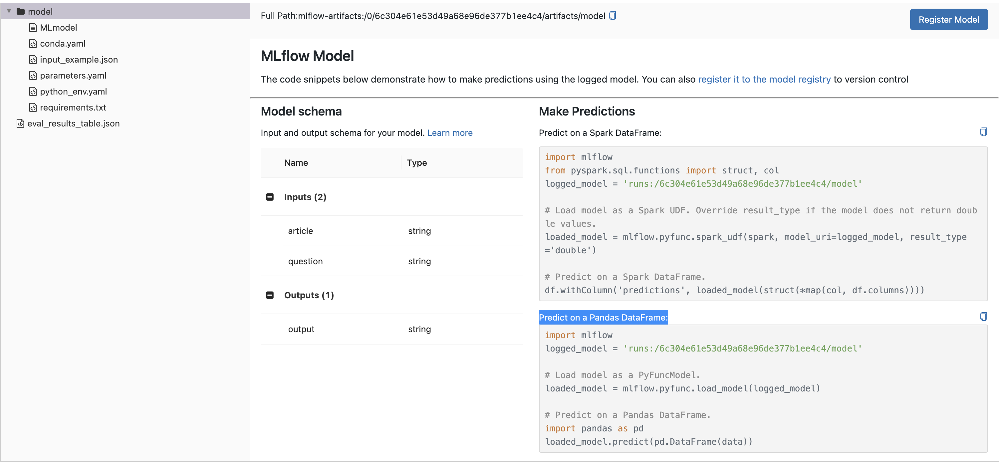
    </figure>

    ~~~ python
    import mlflow

    logged_model = "runs:/8451075c46964f82b85fe16c3d2b7ea0/model"

    # Load model as a PyFuncModel.
    loaded_model = mlflow.pyfunc.load_model(logged_model)
    ~~~

2.  Then, to score the model, call the
    `predict() <mlflow.pyfunc.PyFuncModel.predict>` method and pass in a
    dictionary of input variables. For example:

    ~~~ python
    article_text = """
    An MLflow Project is a format for packaging data science code in a reusable and reproducible way.
    The MLflow Projects component includes an API and command-line tools for running projects, which
    also integrate with the Tracking component to automatically record the parameters and git commit
    of your source code for reproducibility.

    This article describes the format of an MLflow Project and how to run an MLflow project remotely
    using the MLflow CLI, which makes it easy to vertically scale your data science code.
    """
    question = "What is an MLflow project?"

    loaded_model.predict({"article": article_text, "question": question})
    ~~~

    For more information about deployment for real-time serving with
    MLflow, see the `instructions below <deploy-prompt-serving>`.

## Deployment for real-time serving {#deploy-prompt-serving}

Once you have found a configuration of LLM, prompt template, and
parameters that performs well, you can deploy the corresponding MLflow
Model for real-time serving as follows:

1.  Register your model with the MLflow Model Registry. The following
    example registers an MLflow Model created from the
    `Quickstart <quickstart-score>` as Version 1 of the Registered Model
    named `"mlflow_docs_qa_model"`.

    ~~~ python
    mlflow.register_model(
        model_uri="runs:/8451075c46964f82b85fe16c3d2b7ea0/model",
        name="mlflow_docs_qa_model",
    )
    ~~~

2.  Define the following environment variables in the environment where
    you will run your MLflow Model Server, such as a shell on your local
    machine:

    -   `MLFLOW_GATEWAY_URI`: The URL of the MLflow AI Gateway

3.  Use the `mlflow models serve <cli>` command to start the MLflow
    Model Server. For example, running the following command from a
    shell on your local machine will serve the model on port 8000:

    ~~~ bash
    mlflow models serve --model-uri models:/mlflow_docs_qa_model/1 --port 8000
    ~~~

4.  Once the server has been started, it can be queried via REST API
    call. For example:

    > ~~~ bash
    > input='
    > {
    >     "dataframe_records": [
    >         {
    >             "article": "An MLflow Project is a format for packaging data science code...",
    >             "question": "What is an MLflow Project?"
    >         }
    >     ]
    > }'
    >
    > echo $input | curl \
    >   -s \
    >   -X POST \
    >   https://localhost:8000/invocations
    >   -H 'Content-Type: application/json' \
    >   -d @-
    > ~~~
    >
    > where `article` and `question` are replaced with the input
    > variable(s) from your prompt template.
