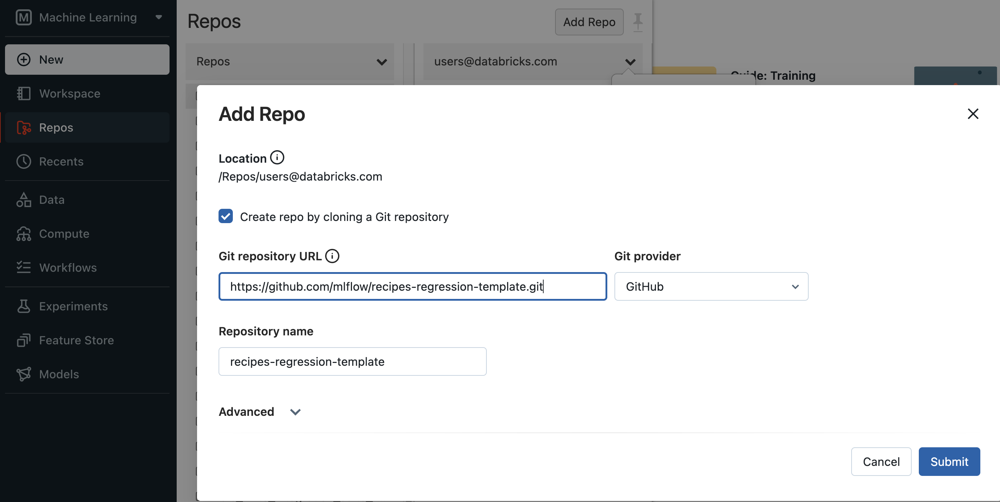
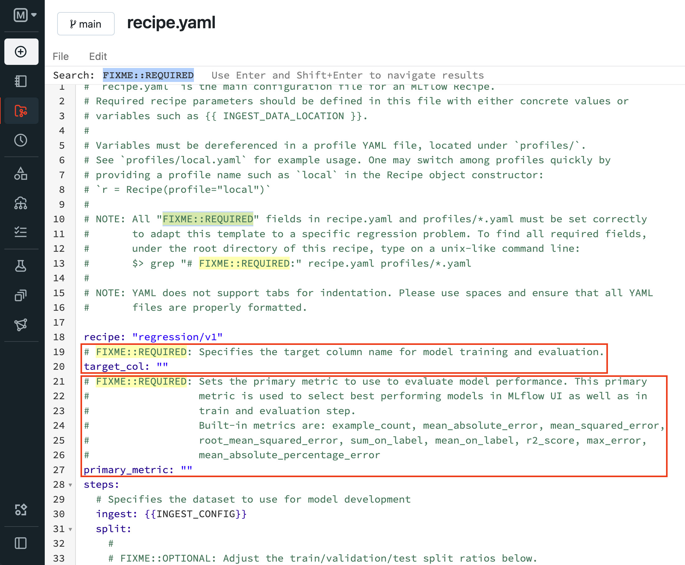
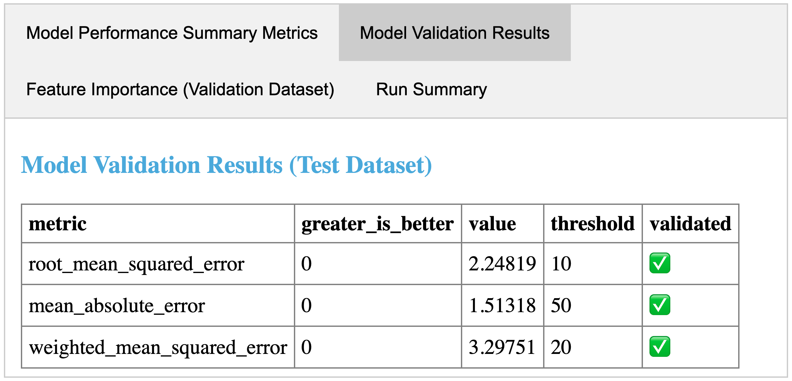
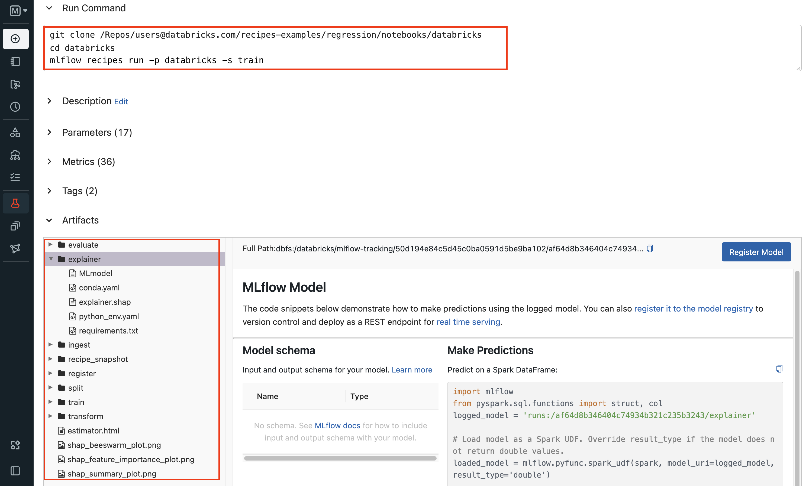
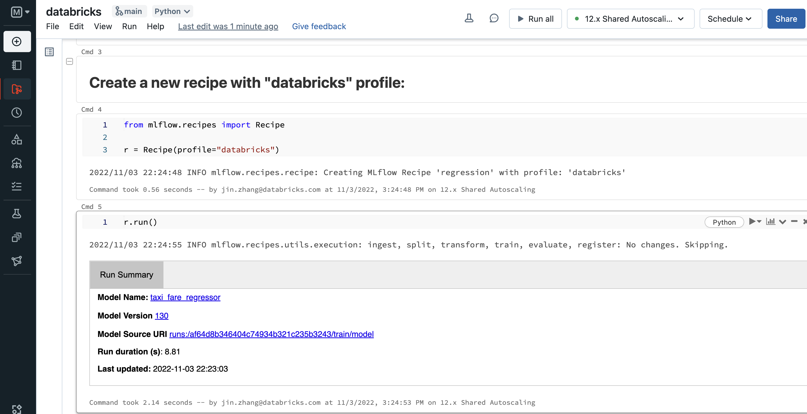
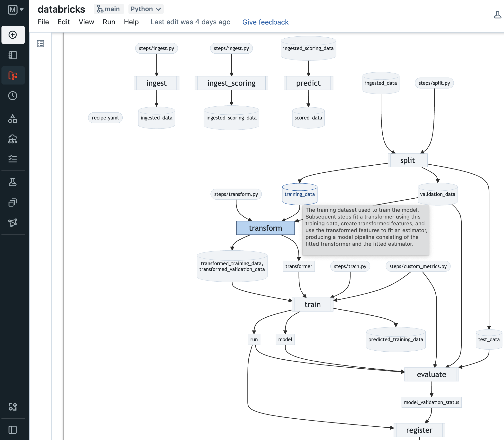
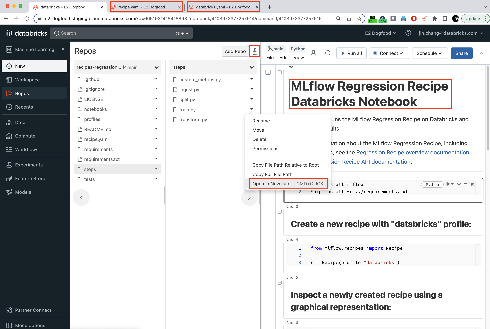

# MLflow Recipes {#recipes}

MLflow Recipes (previously known as MLflow Pipelines) is a framework
that enables data scientists to quickly develop high-quality models and
deploy them to production. Compared to ad-hoc ML workflows, MLflow
Recipes offers several major benefits:

-   **Get started quickly**: `Predefined templates <recipe-templates>`
    for common ML tasks, such as
    `regression modeling <regression-template>`, enable data scientists
    to get started quickly and focus on building great models,
    eliminating the large amount of boilerplate code that is
    traditionally required to curate datasets, engineer features, train
    & tune models, and package models for production deployment.
-   **Iterate faster**: The intelligent recipe execution engine
    accelerates model development by caching results from each step of
    the process and re-running the minimal set of steps as changes are
    made.
-   **Easily ship to production**: The modular, git-integrated
    `recipe structure
    <recipe-templates-key-concept>` dramatically simplifies the handoff
    from development to production by ensuring that all model code,
    data, and configurations are easily reviewable and deployable by ML
    engineers.

## Quickstarts {#quickstarts}

### Prerequisites {#prerequisites}

MLflow Recipes is available as an extension of the [MLflow Python
library](https://pypi.org/project/mlflow/). You can install MLflow
Recipes as follows:

-   **Local**: Install MLflow from PyPI: `pip install mlflow`. Note that
    MLflow Recipes requires [Make](https://www.gnu.org/software/make),
    which may not be preinstalled on some Windows systems. Windows users
    must install Make before using MLflow Recipes. For more information
    about installing Make on Windows, see
    <https://gnuwin32.sourceforge.net/install.html>.

-   **Databricks**: Install MLflow Recipes from a Databricks Notebook by
    running `%pip install mlflow`, or install MLflow Recipes on a
    Databricks Cluster by following the PyPI library installation
    instructions
    [here](https://docs.databricks.com/libraries/cluster-libraries.html#install-a-library-on-a-cluster)
    and specifying the `mlflow` package string.

    

    

    Note

    

    [Databricks Runtime](https://docs.databricks.com/runtime/dbr.html)
    version 11.0 or greater is required in order to install MLflow
    Recipes on Databricks.

    

### NYC taxi fare prediction example {#nyc-taxi-fare-prediction-example}

The [NYC taxi fare prediction
example](https://github.com/mlflow/recipes-examples/tree/main/regression)
uses the `MLflow Recipes Regression Template <regression-template>` to
develop and score models on the [NYC Taxi (TLC) Trip Record
Dataset](https://www1.nyc.gov/site/tlc/about/tlc-trip-record-data.page).
You can run the example locally by
`installing MLflow Recipes <recipes-installation>` and running the
[Jupyter example regression
notebook](https://github.com/mlflow/recipes-examples/blob/main/regression/notebooks/jupyter.ipynb).
You can run the example on Databricks by [cloning the example repository
with Databricks
Repos](https://docs.databricks.com/repos/work-with-notebooks-other-files.html#clone-a-remote-git-repository)
and running the [Databricks example regression
notebook](https://github.com/mlflow/recipes-examples/blob/main/regression/notebooks/databricks.py).

To build and score models for your own use cases, we recommend using the
`MLflow Recipes Regression Template <regression-template>`. For more
information, see the [Regression Template reference
guide](https://github.com/mlflow/recipes-regression-template/blob/main/README.md).

### Classification problem example {#classification-problem-example}

The [Classification problem
example](https://github.com/mlflow/recipes-examples/tree/main/classification)
uses the `MLflow Recipes Classification Template <regression-template>`
to develop and score models on the [Wine Quality
Dataset](https://github.com/mlflow/recipes-examples/tree/main/classification/data).
You can run the example locally by
`installing MLflow Recipes <recipes-installation>` and running the
[Jupyter example classification
notebook](https://github.com/mlflow/recipes-examples/blob/main/classification/notebooks/jupyter.ipynb).
You can run the example on Databricks by [cloning the example repository
with Databricks
Repos](https://docs.databricks.com/repos/work-with-notebooks-other-files.html#clone-a-remote-git-repository)
and running the [Databricks example classification
notebook](https://github.com/mlflow/recipes-examples/blob/main/classification/notebooks/databricks.py).

To build and score models for your own use cases, we recommend using the
`MLflow Recipes Classification Template <regression-template>`. For more
information, see the [Classification Template reference
guide](https://github.com/mlflow/recipes-classification-template/blob/main/README.md).

## Key concepts {#key-concepts}

-   **Steps**: A Step represents an individual ML operation, such as
    ingesting data, fitting an estimator, evaluating a model against
    test data, or deploying a model for real-time scoring. Each Step
    accepts a collection of well-defined inputs and produce well-defined
    outputs according to user-defined configurations and code.

-   **Recipes**: A Recipe is an ordered composition of
    `Steps <steps-key-concept>` used to solve an ML problem or perform
    an MLOps task, such as developing a regression model or performing
    batch model scoring on production data. MLflow Recipes provides
    `APIs <mlflow.recipes.Recipe>` and a `CLI <cli>` for running recipes
    and inspecting their results.

-   **Templates**: A Recipe Template is a git repository with a
    `standardized, modular layout
    <recipe-template-structure>` containing all of the customizable code
    and configurations for a `Recipe <recipes-key-concept>`.
    Configurations are defined in YAML format for easy review via the
    [recipe.yaml](https://github.com/mlflow/recipes-regression-template/blob/main/recipe.yaml)
    file and `Profile YAML files <profiles-key-concept>`. Each template
    also defines its requirements, data science notebooks, and tests.
    MLflow Recipes includes `predefined templates <recipe-templates>`
    for a variety of model development and MLOps tasks.

-   **Profiles**: Profiles contain user-specific or environment-specific
    configurations for a `Recipe <recipes-key-concept>`, such as the
    particular set of hyperparameters being tuned by a data scientist in
    development or the MLflow Model Registry URI and credentials used to
    store production-worthy models. Each profile is represented as a
    YAML file in the `Recipe Template <recipe-templates-key-concept>`
    (e.g.
    [local.yaml](https://github.com/mlflow/recipes-examples/blob/main/regression/profiles/local.yaml)
    and
    [databricks.yaml](https://github.com/mlflow/recipes-examples/blob/main/regression/profiles/databricks.yaml)).

-   **Step Cards**: Step Cards display the results produced by running a
    `Step <steps-key-concept>`, including dataset profiles, model
    performance & explainability plots, overviews of the best model
    parameters found during tuning, and more. Step Cards and their
    corresponding dataset and model information are also logged to
    MLflow Tracking.

## Usage {#usage}

### Model development workflow {#model-development-workflow}

The general model development workflow for using MLflow Recipes is as
follows:

1.  Clone a `Recipe Template <recipe-templates>` git repository
    corresponding to the ML problem that you wish to solve. Follow the
    template's README file for template-specific instructions.

    > -   \[Local\] Clone the
    >     `MLflow Recipes Regression Template <regression-template>`
    >     into a local directory.
    >
    > ~~~ sh
    > git clone https://github.com/mlflow/recipes-regression-template
    > ~~~
    >
    > -   \[Databricks\] Clone the
    >     `MLflow Recipes Regression Template <regression-template>` git
    >     repository using [Databricks
    >     Repos](https://docs.databricks.com/repos/index.html).
    >
    >     

2.  Edit required fields marked by `FIXME::REQUIRED` comments in
    `recipe.yaml` and `profiles/*.yaml`. The recipe is runnable once all
    required fields are filled with proper values. You may proceed to
    step 3 if this is the first time going through this step. Otherwise,
    continue to edit the YAML config files as well as `steps/*.py`
    files, filling out areas marked by `FIXME::OPTIONAL` as you see fit
    to customize the recipe steps to your ML problem for better model
    performance.

    > 

3.  Run the recipe by selecting a desired profile. Profiles are used to
    quickly switch environment specific recipe settings, such as ingest
    data location. When a recipe run completes, you may inspect the run
    results. MLflow Recipes creates and displays an interactive **Step
    Card** with the results of the last executed
    `step <steps-key-concept>`. Each
    `Recipe Template <recipe-templates>` also includes a [Databricks
    Notebook](https://github.com/mlflow/recipes-regression-template/blob/main/notebooks/databricks.py)
    and a [Jupyter
    Notebook](https://github.com/mlflow/recipes-regression-template/blob/main/notebooks/jupyter.ipynb)
    for running the recipe and inspecting its results.

    > 

    >
    > ~~~ python
    > import os
    > from mlflow.recipes import Recipe
    > from mlflow.pyfunc import PyFuncModel
    >
    > os.chdir("~/recipes-regression-template")
    > regression_recipe = Recipe(profile="local")
    > # Run the full recipe
    > regression_recipe.run()
    > # Inspect the model training results
    > regression_recipe.inspect(step="train")
    > # Load the trained model
    > regression_model_recipe: PyFuncModel = regression_recipe.get_artifact("model")
    > ~~~
    >
    > ~~~ sh
    > git clone https://github.com/mlflow/recipes-regression-template
    > cd recipes-regression-template
    > # Run the full recipe
    > mlflow recipes run --profile local
    > # Inspect the model training results
    > mlflow recipes inspect --step train --profile local
    > # Inspect the resulting model performance evaluations
    > mlflow recipes inspect --step evaluate --profile local
    > ~~~
    >
    > 

    >
    > <figure>
    >  style="width:60.0%"
    > alt="../static/images/recipes_evaluate_step_card.png" />
    > <figcaption>An example step card produced by running the
    > <strong>evaluate</strong> step of the <code class="interpreted-text"
    > role="ref">MLflow Recipes Regression Template &lt;regression-template&gt;</code>.
    > The step card results indicate that the trained model passed all
    > performance validations and is ready for registration with the <code
    > class="interpreted-text"
    > role="ref">MLflow Model Registry &lt;registry&gt;</code>.</figcaption>
    > </figure>
    >
    > <figure>
    >  style="width:60.0%"
    > alt="../static/images/recipes_databricks_logged_artifacts.png" />
    > <figcaption>An example MLflow run view page, showing artifacts logged
    > from the Recipe's steps.</figcaption>
    > </figure>
    >
    > <figure>
    >  alt="../static/images/recipes_databricks_notebook_ui.png" />
    > <figcaption>Example recipe run from the <a
    > href="https://github.com/mlflow/recipes-regression-template/blob/main/notebooks/databricks.py">Databricks
    > Notebook</a> included in the <code class="interpreted-text"
    > role="ref">MLflow Recipes Regression Template &lt;regression-template&gt;</code>.</figcaption>
    > </figure>
    >
    > 

    >
    > 

    >
    > Note
    >
    > 

    >
    > Data profiling is often best viewed with "quantiles" mode. To
    > switch it on, on the Facet data profile, find `Chart to show`,
    > click the selector below, and choose `Quantiles`.
    >
    > 

4.  Iterate over step 2 and 3: make changes to an individual step, and
    test them by running the step and observing the results it produces.
    Use `Recipe.inspect()` to visualize the overall Recipe dependency
    graph and artifacts each step produces. Use `Recipe.get_artifact()`
    to further inspect individual step outputs in a notebook.

    MLflow Recipes intelligently caches results from each
    `Recipe Step <steps-key-concept>`, ensuring that steps are only
    executed if their inputs, code, or configurations have changed, or
    if such changes have occurred in dependent steps. Once you are
    satisfied with the results of your changes, commit them to a branch
    of the `Recipe Repository
    <recipe-templates-key-concept>` in order to ensure reproducibility,
    and share or review the changes with your team.

    > <figure>
    >  alt="../static/images/recipes_databricks_dag.png" />
    > <figcaption>Example Recipe.inspect() output, showing the dependency
    > graph of recipe steps and artifacts each step produces.</figcaption>
    > </figure>
    >
    > 

    >
    > 

    >
    > Note
    >
    > 

    >
    > 

    >
    > Before testing changes in a staging or production environment, it
    > is recommended that you commit the changes to a branch of the
    > `Recipe Repository <recipe-templates-key-concept>` to ensure
    > reproducibility.
    >
    > 

    >
    > 

    >
    > Note
    >
    > 

    >
    > 

    >
    > By default, MLflow Recipes caches results from each `Recipe Step
    > <steps-key-concept>` within the `.mlflow` subdirectory of the home
    > folder on the local filesystem. The
    > `MLFLOW_RECIPES_EXECUTION_DIRECTORY` environment variable can be
    > used to specify an alternative location for caching results.

### Development environments {#development-environments}

We recommend using one of the following environment configurations to
develop models with MLflow Recipes:

\[**Databricks**\]

:   -   Edit YAML config and Python files in Databricks Repos. Open
        separate browser tabs for each file module that you wish to
        modify. For example, one for the recipe config file
        `recipe.yaml`, one for the profile config file
        `profile/databricks.yaml`, one for the driver notebook
        `notebooks/databricks.py`, and one for the current step (e.g.
        train) under development `steps/train.py`.
    -   Use `notebooks/databricks.py` as the driver to run recipe steps
        and inspect its output.
    -   Pin the workspace browser for easy file navigation.

    

\[**Local with Jupyter Notebook**\]

:   -   Use `notebooks/jupyter.ipynb` as the driver to run recipe steps
        and inspect its output.
    -   Edit `recipe.yaml`, `steps/*.py` and `profiles/*.yaml`
        accordingly with an editor of your choice.
    -   To run the entire recipe, either run `notebooks/jupyter.ipynb`
        or on commandline, invoke `mlflow recipes run --profile local`
        (change the current working directory to the project root
        first).

\[**Edit locally with IDE (VSCode) and run on Databricks**\]

:   -   Edit files on your local machine with VSCode and Jupyter plugin.
    -   Use [dbx](https://docs.databricks.com/dev-tools/dbx.html) to
        sync them to [Databricks
        Repos](https://docs.databricks.com/repos/index.html) as
        demonstrated below.
    -   On Databricks, use the `notebooks/databricks.py` notebook as the
        driver to run recipe steps and inspect their outputs.

    ~~~ sh
    ~~~

## Recipe Templates {#recipe-templates}

MLflow Recipes currently offers the following predefined templates that
can be easily customized to develop and deploy high-quality,
production-ready models for your use cases:

-   **MLflow Recipes Regression Template**: The MLflow Recipes
    Regression Template is designed for developing and scoring
    regression models. For more information, see the [Regression
    Template reference
    guide](https://github.com/mlflow/recipes-regression-template/blob/main/README.md).
-   **MLflow Recipes Classification Template**: The MLflow Recipes
    Classification Template is designed for developing and scoring
    classification models. For more information, see the [Classification
    Template reference
    guide](https://github.com/mlflow/recipes-classification-template/blob/main/README.md).

Additional recipes for a variety of ML problems and MLOps tasks are
under active development.

## Detailed reference guide {#detailed-reference-guide}

### Template structure {#recipe-template-structure}

Recipe Templates are git repositories with a standardized, modular
layout. The following example provides an overview of the recipe
repository structure. It is adapted from the
`MLflow Recipes Regression Template <regression-template>`.

    ├── recipe.yaml
    ├── requirements.txt
    ├── steps
    │   ├── ingest.py
    │   ├── split.py
    │   ├── transform.py
    │   ├── train.py
    │   ├── custom_metrics.py
    ├── profiles
    │   ├── local.yaml
    │   ├── databricks.yaml
    ├── tests
    │   ├── ingest_test.py
    │   ├── ...
    │   ├── train_test.py
    │   ├── ...

The main components of the Recipe Template layout, which are common
across all recipes, are:

> -   `recipe.yaml`: The main recipe configuration file that
>     declaratively defines the attributes and behavior of each recipe
>     step, such as the input dataset to use for training a model or the
>     performance criteria for promoting a model to production. For
>     reference, see the
>     [recipe.yaml](https://github.com/mlflow/recipes-regression-template/blob/main/recipe.yaml)
>     configuration file from the
>     `MLflow Recipes Regression Template <regression-template>`.
> -   `requirements.txt`: A [pip requirements
>     file](https://pip.pypa.io/en/stable/reference/requirements-file-format)
>     specifying packages that must be installed in order to run the
>     recipe.
> -   `steps`: A directory containing Python code modules used by the
>     recipe steps. For example, the
>     `MLflow Recipes Regression Template <regression-template>` defines
>     the estimator type and parameters to use when training a model in
>     [steps/train.py](https://github.com/mlflow/recipes-regression-template/blob/main/steps/train.py)
>     and defines custom metric computations in
>     [steps/custom_metrics.py](https://github.com/mlflow/recipes-regression-template/blob/main/steps/custom_metrics.py).
>
> 

>
> -   `profiles`: A directory containing
>     `Profile <profiles-key-concept>` customizations for the
>     configurations defined in `recipe.yaml`. For example, the
>     `MLflow Recipes Regression Template <regression-template>` defines
>     a [profiles/local.yaml
>     profile](https://github.com/mlflow/recipes-regression-template/blob/main/profiles/local.yaml)
>     that [customizes the dataset used for local model
>     development](https://github.com/mlflow/recipes-regression-template/blob/main/profiles/local.yaml#L17)
>     and [specifies a local MLflow Tracking store for logging model
>     content](https://github.com/mlflow/recipes-regression-template/blob/main/profiles/local.yaml#L4-L7).
>     The `MLflow Recipes Regression Template <regression-template>`
>     also defines a [profiles/databricks.yaml
>     profile](https://github.com/mlflow/recipes-regression-template/blob/main/profiles/databricks.yaml)
>     for development on Databricks.
> -   `tests`: A directory containing Python test code for recipe steps.
>     For example, the
>     `MLflow Recipes Regression Template <regression-template>`
>     implements tests for the transformer and the estimator defined in
>     the respective `steps/transform.py` and `steps/train.py` modules.
>
> 

~~~ yaml
~~~

### Working with profiles {#working-with-profiles}

A profile is a collection of customizations for the configurations
defined in the recipe's main `recipe.yaml <recipe-template-structure>`
file. Profiles are defined as YAML files within the recipe repository's
`profiles directory <profiles-directory>`. When running a recipe or
inspecting its results, the desired profile is specified as an API or
CLI argument.

~~~ python
import os
from mlflow.recipes import Recipe

os.chdir("~/recipes-regression-template")
# Run the regression recipe to train and evaluate the performance of an ElasticNet regressor
regression_recipe_local_elasticnet = Recipe(profile="local-elasticnet")
regression_recipe_local_elasticnet.run()
# Run the recipe again to train and evaluate the performance of an SGD regressor
regression_recipe_local_sgd = Recipe(profile="local-sgd")
regression_recipe_local_sgd.run()
# After finding the best model type and updating the 'shared-workspace' profile accordingly,
# run the recipe again to retrain the best model in a workspace where teammates can view it
regression_recipe_shared = Recipe(profile="shared-workspace")
regression_recipe_shared.run()
~~~

~~~ sh
git clone https://github.com/mlflow/recipes-regression-template
cd recipes-regression-template
# Run the regression recipe to train and evaluate the performance of an ElasticNet regressor
mlflow recipes run --profile local-elasticnet
# Run the recipe again to train and evaluate the performance of an SGD regressor
mlflow recipes run --profile local-sgd
# After finding the best model type and updating the 'shared-workspace' profile accordingly,
# run the recipe again to retrain the best model in a workspace where teammates can view it
mlflow recipes run --profile shared-workspace
~~~

The following profile customizations are supported:

> -   
>
>     overrides
>
>     :   -   If the `recipe.yaml` configuration file defines a
>             [Jinja2](https://jinja.palletsprojects.com)-templated
>             attribute with a default value, a profile can override the
>             value by mapping the attribute to a different value using
>             YAML dictionary syntax. Note that override values may have
>             arbitrarily nested types (e.g. lists, dictionaries, lists
>             of dictionaries, ...).
>
>             ~~~ yaml
>             ~~~
>
>             ~~~ yaml
>             ~~~
>
> -   
>
>     substitutions
>
>     :   -   If the `recipe.yaml` configuration file defines a
>             [Jinja2](https://jinja.palletsprojects.com)-templated
>             attribute without a default value, a profile *must* map
>             the attribute to a specific value using YAML dictionary
>             syntax. Note that substitute values may have arbitrarily
>             nested types (e.g. lists, dictionaries, lists of
>             dictionaries, ...).
>
>             ~~~ yaml
>             ~~~
>
>             ~~~ yaml
>             ~~~
>
> -   
>
>     additions
>
>     :   -   If the `recipe.yaml` configuration file does not define a
>             particular attribute, a profile may define it instead.
>             This capability is helpful for providing values of
>             optional configurations that, if unspecified, a recipe
>             would otherwise ignore.
>
>             ~~~ yaml
>             ~~~
>
> 

>
> 

>
> Warning
>
> 

>
> If the `recipe.yaml` configuration file defines an attribute that
> cannot be overridden or substituted (i.e. because its value is not
> specified using [Jinja2](https://jinja.palletsprojects.com) templating
> syntax), a profile must not define it. Defining such an attribute in a
> profile produces an error.
>
> 

